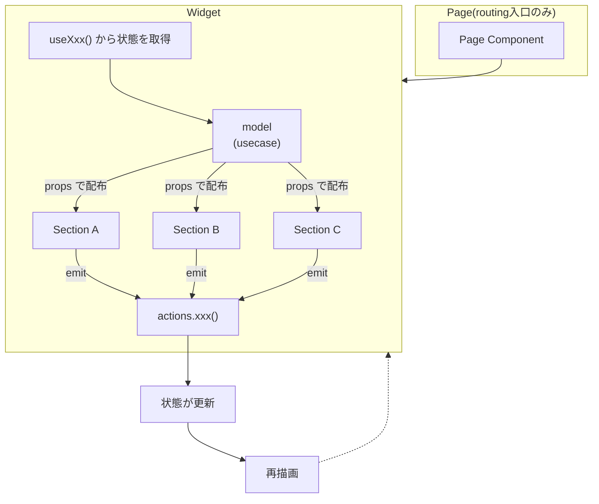

# CDD（コンポーネント駆動開発）設計ガイド

このドキュメントでは、Vue3 マイグレーションで採用する「コンポーネント駆動開発（CDD）」の考え方を説明します。

---

## なぜ CDD を採用するのか

### Vue2 時代の開発でありがちだった問題

```
画面を作る → 大きくなる → 後から部品に分ける → うまく分けられない
```

- 画面に直接 API 呼び出しを書く
- 状態があちこちに散らばる
- 同じような UI を何度も作り直す
- テストが難しい（画面全体を起動しないと確認できない）

### CDD ではこう変わる

```
部品を先に作る → Storybook で確認する → 画面に組み込む
```

- API 呼び出しは専用の層に分離
- 状態は 1 箇所に集約
- UI 部品は再利用可能
- 部品単体でテスト・確認できる

---

## CDD の 3 つの基本原則

### 原則 1：コンポーネントは「状態・表示・振る舞い」を持つ

コンポーネントは単なる HTML の断片ではありません。

- **どんな状態があるのか**（通常、エラー、ローディングなど）
- **その状態でどう表示されるのか**
- **ユーザー操作でどう振る舞うのか**

を、コンポーネント単体で説明できる必要があります。

### 原則 2：画面は「組み合わせ結果」でしかない

画面はロジックを持つ場所ではありません。画面でやってよいことは：

- ✅ どのコンポーネントを配置するか決める
- ✅ ルーティングに対応する
- ✅ 画面遷移を制御する

画面でやってはいけないことは：

- ❌ API を直接呼ぶ
- ❌ ビジネスロジックを書く
- ❌ 複雑な if 文で表示を制御する

### 原則 3：データの流れは一本道にする

```
[model] → [widget] → [sections] → emit → [widget] → [actions] → [model]
```

- 状態を持つ場所は 1 箇所（model）
- データは **props** で下に流す
- 変更は **emit** で上に戻す
- **actions** 経由で状態を更新する

---

## コンポーネントの種類と役割

このプロジェクトでは、コンポーネントを以下の 6 種類に分類します。

```
pages
  └── widgets
        └── sections
              └── shared/ui

features/model（状態管理）
entities（ドメインロジック）
```

### 1. pages（画面の入口）

**役割：** ルーティングの入口。画面遷移を制御する。

```vue
<!-- pages/items/ItemsListPage.vue -->
<template>
  <ItemsListWidget />
</template>

<script setup lang="ts">
import ItemsListWidget from '@/widgets/items/ItemsListWidget.vue'
</script>
```

**やってよいこと：**
- ルーティングに対応するコンポーネントを配置
- 画面遷移を制御
- 権限チェック（必要なら）

**やってはいけないこと：**
- ❌ API 呼び出し
- ❌ フォームの状態管理
- ❌ ビジネスロジック

---

### 2. widgets（画面の骨組み）

**役割：** 1 画面を構成するための親コンポーネント。状態と子コンポーネントをつなぐ。

```vue
<!-- widgets/items/ItemsListWidget.vue -->
<template>
  <div>
    <ItemsTable
      :items="view.items"
      :loading="ui.loading"
      @select="actions.selectItem"
    />
    <ItemsPagination
      :page="view.page"
      :totalPages="view.totalPages"
      @change="actions.changePage"
    />
  </div>
</template>

<script setup lang="ts">
import { useItemsList } from '@/features/items/useItemsList'
import ItemsTable from '@/sections/items/ItemsTable.vue'
import ItemsPagination from '@/sections/items/ItemsPagination.vue'

const { view, ui, actions } = useItemsList()
</script>
```

**やってよいこと：**
- sections を並べる
- model（usecase）から状態を取得
- 子コンポーネントに props で状態を配る
- 子コンポーネントからの emit を受けて actions を呼ぶ

**やってはいけないこと：**
- ❌ 状態の「真実」を持つ（状態は model に委ねる）
- ❌ ビジネスロジックを書く

---

### 3. sections（意味のある塊）

**役割：** 画面を意味のある塊に分けた中粒度のコンポーネント。

```vue
<!-- sections/items/ItemsTable.vue -->
<template>
  <table>
    <tr v-for="item in items" :key="item.id" @click="$emit('select', item.id)">
      <td>{{ item.name }}</td>
      <td>{{ item.price }}</td>
    </tr>
  </table>
  <LoadingOverlay v-if="loading" />
</template>

<script setup lang="ts">
interface Props {
  items: Array<{ id: string; name: string; price: number }>
  loading: boolean
}

defineProps<Props>()
defineEmits<{
  select: [id: string]
}>()
</script>
```

**やってよいこと：**
- props で値を受け取る
- ユーザー操作を emit で返す
- 純粋に UI 上の都合で必要な状態を持つ（カルーセル位置など）

**やってはいけないこと：**
- ❌ API 呼び出し
- ❌ 状態の「真実」を持つ
- ❌ ビジネスロジック

---

### 4. shared/ui（共通 UI 部品）

**役割：** アプリ全体で使い回す UI 部品。

```vue
<!-- shared/ui/Button/Button.vue -->
<template>
  <button
    :class="['btn', `btn--${variant}`, `btn--${size}`]"
    :disabled="disabled || loading"
    @click="$emit('click')"
  >
    <span v-if="loading">読み込み中...</span>
    <slot v-else />
  </button>
</template>

<script setup lang="ts">
interface Props {
  variant?: 'primary' | 'secondary' | 'danger'
  size?: 'sm' | 'md' | 'lg'
  disabled?: boolean
  loading?: boolean
}

withDefaults(defineProps<Props>(), {
  variant: 'primary',
  size: 'md',
  disabled: false,
  loading: false
})

defineEmits<{
  click: []
}>()
</script>
```

**特徴：**
- 見た目、入力体験、アクセシビリティに集中
- 業務ロジックや API 処理は一切持たない
- どの画面でも同じ意味なら同じ見た目

---

### 5. features/model（状態とビジネスロジック）

**役割：** この設計の「心臓部」。状態の唯一の真実を持つ。

```typescript
// features/items/useItemsList.ts
import { ref, computed } from 'vue'
import { fetchItems } from '@/services/itemsService'

export const useItemsList = () => {
  // 状態
  const items = ref<Item[]>([])
  const page = ref(1)
  const loading = ref(false)
  const error = ref<string | null>(null)

  // 表示用の導出値
  const view = computed(() => ({
    items: items.value,
    page: page.value,
    totalPages: Math.ceil(items.value.length / 10)
  }))

  // UI 状態
  const ui = computed(() => ({
    loading: loading.value,
    hasError: error.value !== null
  }))

  // 操作
  const actions = {
    async load() {
      loading.value = true
      try {
        items.value = await fetchItems()
      } catch (e) {
        error.value = 'データの取得に失敗しました'
      } finally {
        loading.value = false
      }
    },
    selectItem(id: string) {
      // 選択処理
    },
    changePage(newPage: number) {
      page.value = newPage
    }
  }

  return { view, ui, actions }
}
```

**公開する形（固定）：**
- `form`：入力値の唯一の真実
- `view`：表示用の導出値
- `ui`：表示制御用の状態（loading, touched, dirty など）
- `errors`：バリデーション結果
- `actions`：状態更新・送信などの操作

---

### 5-1. Composable 内部構成の標準パターン

Composable（`useXxx` 関数）の内部は、以下の **4 つのセクション** で統一して記述します。
これにより、実装者による差異をなくし、可読性とメンテナンス性を向上させます。

```typescript
// features/tasks/model/useTaskList.ts
import { ref, computed, watch } from 'vue'
import type { Task, TaskListResponse } from '../types'

export function useTaskList() {
  // ===================================
  // State（状態）
  // ===================================
  // - ref() で定義するリアクティブな値
  // - この Composable が管理する「真実」
  const tasks = ref<Task[]>([])
  const isLoading = ref(false)
  const error = ref<Error | null>(null)
  const selectedTaskId = ref<string | null>(null)
  const page = ref(1)
  const limit = ref(10)
  const sortBy = ref<string>('workDate')
  const sortOrder = ref<'asc' | 'desc'>('desc')

  // ===================================
  // Computed（導出値）
  // ===================================
  // - State から導出される読み取り専用の値
  // - view / ui / pagination などに分類
  
  /** 選択中のタスク */
  const selectedTask = computed(() => {
    if (!selectedTaskId.value) return null
    return tasks.value.find(t => t.id === selectedTaskId.value) || null
  })
  
  /** ページネーション情報 */
  const pagination = computed(() => ({
    page: page.value,
    limit: limit.value,
    total: total.value,
    totalPages: totalPages.value,
    hasNext: page.value < totalPages.value,
    hasPrev: page.value > 1,
  }))
  
  /** UI 状態 */
  const ui = computed(() => ({
    isLoading: isLoading.value,
    hasError: error.value !== null,
    isEmpty: tasks.value.length === 0,
  }))

  // ===================================
  // Actions（操作）
  // ===================================
  // - State を変更する関数
  // - API 呼び出しもここで行う
  // - 非同期処理は async/await で記述
  
  /** タスク一覧を取得 */
  async function fetchTasks() {
    isLoading.value = true
    error.value = null
    try {
      const params = new URLSearchParams({
        page: String(page.value),
        limit: String(limit.value),
        sortBy: sortBy.value,
        sortOrder: sortOrder.value,
      })
      const response = await fetch(`/api/tasks?${params}`)
      const data: TaskListResponse = await response.json()
      tasks.value = data.items
    } catch (e) {
      error.value = e instanceof Error ? e : new Error(String(e))
    } finally {
      isLoading.value = false
    }
  }
  
  /** ページ変更 */
  function changePage(newPage: number) {
    page.value = newPage
    selectedTaskId.value = null
  }
  
  /** タスクを選択 */
  function selectTask(taskId: string | null) {
    selectedTaskId.value = taskId
  }

  // ===================================
  // Watchers（監視）
  // ===================================
  // - State の変化を監視して副作用を実行
  // - 自動再取得などに使用
  
  // ページ/ソート変更時に自動で再取得
  watch([page, sortBy, sortOrder, limit], () => {
    fetchTasks()
  })

  // ===================================
  // Return（公開インターフェース）
  // ===================================
  return {
    // State（必要に応じて公開）
    tasks,
    isLoading,
    error,
    selectedTaskId,
    
    // Computed
    selectedTask,
    pagination,
    ui,
    
    // Actions
    fetchTasks,
    changePage,
    selectTask,
  }
}
```

#### セクション別ガイドライン

| セクション | 役割 | 命名規則 | 備考 |
|-----------|------|---------|------|
| **State** | リアクティブな値を定義 | 名詞（`items`, `isLoading`） | `ref()` または `reactive()` |
| **Computed** | State から導出される値 | 名詞（`selectedItem`, `pagination`） | `computed()` で定義 |
| **Actions** | State を変更する操作 | 動詞（`fetchItems`, `selectItem`） | `function` で定義 |
| **Watchers** | State 変化時の副作用 | - | `watch()` で定義 |

#### なぜ 4 セクション構成なのか？

1. **可読性**: どこに何があるか一目でわかる
2. **一貫性**: チーム全体で同じ構成になる
3. **保守性**: 変更箇所を特定しやすい
4. **レビュー効率**: 構成が統一されているので確認が容易

#### 簡易版（小規模な Composable）

小さな Composable では、State と Actions のみで十分な場合もあります：

```typescript
export function useCounter() {
  // State
  const count = ref(0)
  
  // Actions
  const increment = () => count.value++
  const decrement = () => count.value--
  
  return { count, increment, decrement }
}
```

---

### 6. entities（ドメインロジック）

**役割：** 「ドメインとして正しいか」を判断する純関数。

```typescript
// entities/item/validateItem.ts
export interface ItemValidationResult {
  valid: boolean
  errors: {
    name?: string
    price?: string
  }
}

export const validateItem = (item: { name: string; price: number }): ItemValidationResult => {
  const errors: ItemValidationResult['errors'] = {}

  if (!item.name || item.name.trim() === '') {
    errors.name = '名前は必須です'
  }

  if (item.price < 0) {
    errors.price = '価格は0以上にしてください'
  }

  return {
    valid: Object.keys(errors).length === 0,
    errors
  }
}
```

**特徴：**
- UI に依存しない
- API に依存しない
- 副作用を持たない純関数
- テストが容易

---

## データフロー図



---

## よくあるアンチパターン

### ❌ 子コンポーネントが状態の「真実」を持つ

```vue
<!-- ❌ NG: Section 内で状態を管理している -->
<script setup>
const localItems = ref([]) // ← これがダメ

onMounted(async () => {
  localItems.value = await fetchItems()
})
</script>
```

→ 状態は model（usecase）に集約する

### ❌ UI から直接 API を呼ぶ

```vue
<!-- ❌ NG: Section 内で API を呼んでいる -->
<script setup>
const save = async () => {
  await axios.post('/api/items', item.value) // ← これがダメ
}
</script>
```

→ API 呼び出しは actions 経由で行う

### ❌ v-model の多段バケツリレー

```vue
<!-- ❌ NG: v-model を何層も受け渡す -->
<GrandParent v-model="value">
  <Parent v-model="value">
    <Child v-model="value" />
  </Parent>
</GrandParent>
```

→ model で状態を管理し、props と emit でシンプルに渡す

---

## 判断に迷ったら

以下を自問してください：

1. **この状態の真実はどこか？**
   → 1 箇所だけに集約されているか確認

2. **これは UI の都合か、ビジネスルールか？**
   → UI の都合なら UI 層、ビジネスルールなら entities/model

3. **props と emit だけで説明できるか？**
   → できないなら設計を見直す

---

## まとめ

| 種類 | 責務 | 状態を持つ | API を呼ぶ |
|------|------|:----------:|:----------:|
| pages | ルーティング入口 | ❌ | ❌ |
| widgets | 画面骨組み・配線 | ❌ | ❌ |
| sections | 表示・入力 | UI状態のみ | ❌ |
| shared/ui | 共通部品 | UI状態のみ | ❌ |
| features/model | 状態・ロジック | ✅ | ✅ |
| entities | ドメイン判定 | ❌ | ❌ |

---

## 次のステップ

設計の考え方を理解したら、[03_ディレクトリ構成ガイド](./03_ディレクトリ構成ガイド.md) で実際のファイル配置を確認しましょう。
