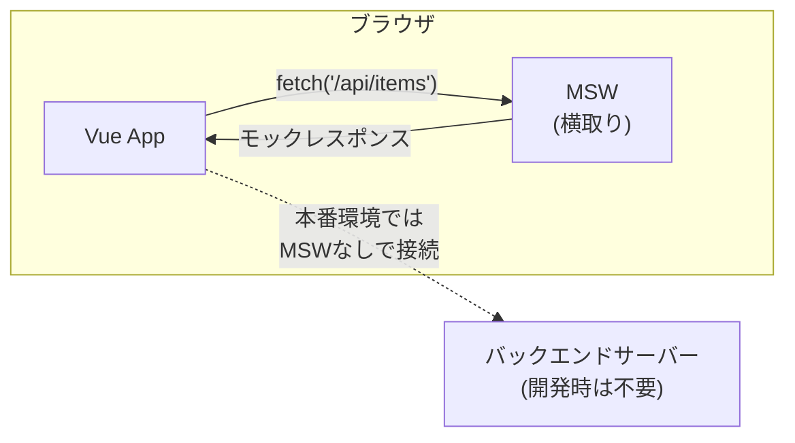

# MSW（Mock Service Worker）入門

このドキュメントでは、MSW を使ったことがない人向けに、「MSW とは何か」「なぜ使うのか」「どう使うのか」を説明します。

---

## MSW とは

### 一言で言うと

MSW は、**フロントエンドから呼び出される API 通信を横取りして、あらかじめ定義したレスポンスを返す仕組み**です。

### Vue2 時代の開発（モックなし）

```
1. バックエンド API が完成するのを待つ
2. API が動くサーバーを起動する
3. フロントエンドを開発する
4. エラー系の確認は難しい（サーバー側で再現が必要）
```

問題点：
- バックエンドの完成を待たないと開発できない
- エラー系（500 エラーなど）の再現が難しい
- ネットワーク遅延の再現ができない

### MSW があると

```
1. API 仕様（Swagger など）を見る
2. MSW でモック（偽の API）を作る
3. バックエンドなしでフロントエンドを開発する
4. 正常系・エラー系・遅延を自由に切り替えられる
```

メリット：
- バックエンドを待たずに開発できる
- エラー系のテストが簡単
- 開発環境のセットアップが楽

---

## MSW の仕組み



MSW は Service Worker を使ってブラウザレベルで通信を横取りするため、**フロントエンドのコードを変更せずに**モックを差し込めます。

---

## MSW の構成要素

| 用語 | 説明 | 例 |
|------|------|-----|
| **handler** | 1 つの API エンドポイントに対する振る舞い | GET /api/items → 商品一覧を返す |
| **fixture** | モックで返すデータ | `[{ id: '1', name: '商品A' }, ...]` |
| **scenario** | handler のセット（状況別） | 正常系セット、エラー系セット |

---

## ディレクトリ構成

このプロジェクトでは、MSW の定義（handler / fixture / scenario）は Vue2 / Vue3 で共通利用するため、`fe-libs/` に配置します。

```
fe-libs/
├── mocks/                   # MSW モック定義（主な作業場所）
│   ├── handlers/            # API ごとの handler
│   │   ├── index.ts
│   │   ├── items.handlers.ts
│   │   └── auth.handlers.ts
│   ├── fixtures/            # レスポンス用データ
│   │   ├── items.normal.ts
│   │   ├── items.empty.ts
│   │   ├── items.large.ts
│   │   └── bugs/            # バグ再現用（JSON 許可）
│   ├── scenarios/           # handler セット（切り替え用）
│   │   └── items.scenarios.ts
│   └── index.ts
│
├── types/                   # API DTO 型定義
│   ├── generated/           # OpenAPI から自動生成（編集禁止）
│   └── index.ts
│
└── openapi/                 # Swagger / OpenAPI 定義

vue3-app/src/
├── mocks/
│   └── browser.ts           # MSW 初期化（基盤担当が管理）
└── devtools/msw-harness/    # MSW 動作確認用（dev-only）
    ├── scenarioRegistry.ts  # scenario の登録
    ├── apiCatalog.ts        # 確認したい API の登録
    └── MswHarnessPage.vue   # 確認画面（基盤担当が管理）
```

**重要：**
- `fe-libs/mocks/` が handler / fixture / scenario の作業場所
- `vue3-app/src/mocks/browser.ts` は編集不要（基盤担当が管理）

---

## handler の書き方

### 基本構造

```typescript
// fe-libs/mocks/handlers/items.handlers.ts
import { http, HttpResponse } from 'msw'
import { itemsNormal } from '../fixtures/items.normal'

// GET /api/items → 商品一覧を返す
export const getItemsHandler = http.get('/api/items', () => {
  return HttpResponse.json(itemsFixture)
})

// GET /api/items/:id → 商品詳細を返す
export const getItemHandler = http.get('/api/items/:id', ({ params }) => {
  const { id } = params
  const item = itemsFixture.find(i => i.id === id)
  
  if (!item) {
    return HttpResponse.json(
      { message: 'Not Found' },
      { status: 404 }
    )
  }
  
  return HttpResponse.json(item)
})

// POST /api/items → 商品を作成
export const createItemHandler = http.post('/api/items', async ({ request }) => {
  const body = await request.json()
  
  const newItem = {
    id: String(Date.now()),
    ...body,
    createdAt: new Date().toISOString()
  }
  
  return HttpResponse.json(newItem, { status: 201 })
})

// DELETE /api/items/:id → 商品を削除
export const deleteItemHandler = http.delete('/api/items/:id', () => {
  return new HttpResponse(null, { status: 204 })
})
```

---

## インメモリストアパターン（POST/PUT/DELETE の反映）

### 課題

上記の基本的な handler の書き方では、以下のような問題があります：

```
1. POST /api/items で商品を登録
2. GET /api/items で一覧を取得
→ 登録した商品が一覧に含まれない！
```

これは、各 handler が独立しており、**データの状態を共有していない**ためです。

### 解決策：インメモリストアパターン

**インメモリストア**を使って、handler 間でデータを共有します。

```typescript
// fe-libs/mocks/handlers/items.handlers.ts
import { http, HttpResponse, delay } from 'msw'
import { itemsNormalFixture, type ItemFixture } from '../fixtures/items'

// ===================================
// インメモリデータストア
// ===================================

// fixture をコピーして初期データとする
let itemsData: ItemFixture[] = [...itemsNormalFixture]

/**
 * データをリセット（テスト用）
 * Vitest などからテストごとにリセットできる
 */
export function resetItemsData() {
  itemsData = [...itemsNormalFixture]
}

// ===================================
// Handlers
// ===================================

/**
 * GET /api/items - 一覧取得
 * インメモリストアからデータを返す
 */
export const getItemsHandler = http.get('/api/items', async () => {
  await delay(100)
  return HttpResponse.json({ items: itemsData })
})

/**
 * POST /api/items - 新規作成
 * インメモリストアにデータを追加
 */
export const createItemHandler = http.post('/api/items', async ({ request }) => {
  await delay(200)
  
  const body = await request.json() as Omit<ItemFixture, 'id' | 'createdAt'>
  const now = new Date().toISOString()
  
  const newItem: ItemFixture = {
    ...body,
    id: `item-${itemsData.length + 1}`,
    createdAt: now,
  }
  
  // インメモリストアに追加
  itemsData.push(newItem)
  
  return HttpResponse.json(newItem, { status: 201 })
})

/**
 * PUT /api/items/:id - 更新
 * インメモリストアのデータを更新
 */
export const updateItemHandler = http.put('/api/items/:id', async ({ params, request }) => {
  await delay(200)
  
  const { id } = params
  const itemIndex = itemsData.findIndex(item => item.id === id)
  
  if (itemIndex === -1) {
    return HttpResponse.json({ message: 'Not Found' }, { status: 404 })
  }
  
  const body = await request.json() as Partial<ItemFixture>
  
  // インメモリストアを更新
  itemsData[itemIndex] = {
    ...itemsData[itemIndex],
    ...body,
    id: itemsData[itemIndex].id, // ID は変更不可
  }
  
  return HttpResponse.json(itemsData[itemIndex])
})

/**
 * DELETE /api/items/:id - 削除
 * インメモリストアからデータを削除
 */
export const deleteItemHandler = http.delete('/api/items/:id', async ({ params }) => {
  await delay(200)
  
  const { id } = params
  const itemIndex = itemsData.findIndex(item => item.id === id)
  
  if (itemIndex === -1) {
    return HttpResponse.json({ message: 'Not Found' }, { status: 404 })
  }
  
  // インメモリストアから削除
  itemsData.splice(itemIndex, 1)
  
  return new HttpResponse(null, { status: 204 })
})
```

### ポイント

| 要素 | 説明 |
|------|------|
| `let itemsData` | モジュールスコープの変数。handler 間で共有される |
| `[...itemsNormalFixture]` | fixture のコピーを使う（元データを変更しない） |
| `resetItemsData()` | テストやシナリオ切り替え時にリセット |
| `itemsData.push()` | POST 時に配列に追加 |
| `itemsData[index] = ...` | PUT 時に更新 |
| `itemsData.splice()` | DELETE 時に削除 |

### 注意事項

```typescript
// ❌ NG: fixture を直接変更してしまう
let itemsData = itemsNormalFixture
itemsData.push(newItem) // fixture 自体が変わってしまう！

// ✅ OK: スプレッド演算子でコピーを作る
let itemsData = [...itemsNormalFixture]
itemsData.push(newItem) // コピーを変更するだけ
```

### IDからマスタ情報を参照する

フォームでは ID のみを送信し、一覧ではマスタ情報（名前など）も必要な場合があります。
この場合、handler 内でマスタの fixture を参照して変換します。

```typescript
import { workersFixture } from '../fixtures/masters/workers'
import { machinesFixture } from '../fixtures/masters/machines'

/**
 * リクエストからレスポンス形式に変換
 */
function convertRequestToItem(body: RequestBody): ItemFixture {
  // 作業者ID → 作業者情報
  const workers = body.workerIds
    .map(id => workersFixture.find(w => w.id === id))
    .filter((w): w is Worker => w !== null)
    .map(w => ({ id: w.id, name: w.name }))
  
  // 機械ID → 機械情報
  const machine = machinesFixture.find(m => m.id === body.machineId)
  
  return {
    workDate: body.workDate,
    workers,
    machine: machine ? { id: machine.id, name: machine.name } : null,
  }
}

export const createItemHandler = http.post('/api/items', async ({ request }) => {
  const body = await request.json() as RequestBody
  
  // ID から名前情報を付与
  const itemData = convertRequestToItem(body)
  
  const newItem = {
    ...itemData,
    id: `item-${itemsData.length + 1}`,
    createdAt: new Date().toISOString(),
  }
  
  itemsData.push(newItem)
  return HttpResponse.json(newItem, { status: 201 })
})
```

### ブラウザリロード時の挙動

インメモリストアはブラウザのメモリ上に存在するため、**ページをリロードするとリセット**されます。
これは意図した挙動であり、開発中にいつでも初期状態に戻せる利点があります。

```
リロード前: fixture + 追加したデータ
    ↓ リロード
リロード後: fixture のみ（初期状態）
```

### ハンドラーの集約

```typescript
// fe-libs/mocks/handlers/index.ts
import {
  getItemsHandler,
  getItemHandler,
  createItemHandler,
  deleteItemHandler,
} from './items.handlers'
import { loginHandler, logoutHandler } from './auth.handlers'

export const handlers = [
  // Items
  getItemsHandler,
  getItemHandler,
  createItemHandler,
  deleteItemHandler,
  // Auth
  loginHandler,
  logoutHandler,
]
```

---

## fixture の書き方

### 基本ルール

fixture は **API が実際に返すレスポンスデータそのもの** です。

```typescript
// fe-libs/mocks/fixtures/items.normal.ts

// 正常系データ
export const itemsNormal = [
  {
    id: '1',
    name: '商品A',
    price: 1000,
    createdAt: '2024-01-01T00:00:00Z'
  },
  {
    id: '2',
    name: '商品B',
    price: 2000,
    createdAt: '2024-01-02T00:00:00Z'
  },
  {
    id: '3',
    name: '商品C',
    price: 3000,
    createdAt: '2024-01-03T00:00:00Z'
  }
]

// 空データ（別ファイルに分ける）
// fe-libs/mocks/fixtures/items.empty.ts
export const itemsEmpty: typeof itemsNormal = []
```

```typescript
// 大量データ（境界値テスト用）
// fe-libs/mocks/fixtures/items.large.ts
export const itemsLarge = Array.from({ length: 500 }, (_, i) => ({
  id: String(i + 1),
  name: `商品${i + 1}`,
  price: (i + 1) * 100,
  createdAt: new Date(2024, 0, i + 1).toISOString()
}))
```

### 例外：バグ再現用 fixture は JSON を許可

結合テスト等で発生した UI バグを確実に再現するために、**実際のレスポンス body（JSON）をそのまま fixture として保存したい**場合があります。

この用途に限り、fixture を **JSON ファイルとして保存することを例外的に許可**します。

- 目的：**「実データをそのまま使って再現する」**
- 注意：UI 都合で改変しない（実データの写しとして扱う）

推奨命名（例）：

```
fe-libs/mocks/fixtures/bugs/bug-12345.items.json
fe-libs/mocks/fixtures/bugs/bug-12345.order.json
```

> JSON を使うのは **「bug再現」などの例外ケースに限定**し、通常の fixture は TS を基本とします。

### 境界値・大量データは動的生成も可

境界値テストや大量データによる表示・性能確認では、**ループ（Array.from 等）でデータを動的生成**したほうが、

- 修正しやすい
- 意図が明確
- 視認性が高い

という利点があります。

この用途に限り、**fixture ファイル内でのみ**動的生成を許可します。

**ルール**：

- 動的生成は **fixtures 配下だけ**で行う（handler 内は禁止）
- 乱数・現在時刻など、再現性を壊す要素は使わない
- 生成ロジックは単純に保つ（レビューしやすく）

例：

```typescript
// fe-libs/mocks/fixtures/items.boundary.ts
// 境界値：0件、1件、100件
export const itemsBoundary0 = []
export const itemsBoundary1 = [{ id: '1', name: '商品1', price: 100 }]
export const itemsBoundary100 = Array.from({ length: 100 }, (_, i) => ({
  id: String(i + 1),
  name: `商品${i + 1}`,
  price: (i + 1) * 10,
}))
```

### fixture の禁止事項

- ❌ UI 都合でデータ構造を変える
- ❌ プロパティを省略する
- ❌ 型を変える（string を number にするなど）
- ❌ handler 内で乱数や現在時刻を使う（再現性がなくなる）

→ **API 仕様（Swagger）どおりに作る**

---

## 異常系（エラー）の handler

### 400 Bad Request

```typescript
export const createItemBadRequestHandler = http.post('/api/items', () => {
  return HttpResponse.json(
    {
      message: 'Validation Error',
      errors: {
        name: '商品名は必須です',
        price: '価格は0以上にしてください'
      }
    },
    { status: 400 }
  )
})
```

### 401 Unauthorized

```typescript
export const getItemsUnauthorizedHandler = http.get('/api/items', () => {
  return HttpResponse.json(
    { message: 'Unauthorized' },
    { status: 401 }
  )
})
```

### 404 Not Found

```typescript
export const getItemNotFoundHandler = http.get('/api/items/:id', () => {
  return HttpResponse.json(
    { message: 'Not Found' },
    { status: 404 }
  )
})
```

### 500 Internal Server Error

```typescript
export const getItemsServerErrorHandler = http.get('/api/items', () => {
  return new HttpResponse(null, { status: 500 })
})
```

### ネットワークエラー

```typescript
export const getItemsNetworkErrorHandler = http.get('/api/items', () => {
  return HttpResponse.error()
})
```

### 遅延（ローディング確認用）

```typescript
import { delay } from 'msw'

export const getItemsDelayHandler = http.get('/api/items', async () => {
  await delay(3000) // 3秒遅延
  return HttpResponse.json(itemsFixture)
})
```

---

## scenario（シナリオ）

シナリオは **「どの handler を有効にするか」のセット** です。

**重要：** scenario は handler をまとめるだけの存在です。切り替えロジックや条件分岐は書きません。

```typescript
// fe-libs/mocks/scenarios/items.scenarios.ts
import {
  getItemsNormalHandler,
  getItemHandler,
  createItemHandler,
  getItemsEmptyHandler,
  getItemsServerErrorHandler,
} from '../handlers/items.handlers'

export const itemsScenarios = {
  // 正常系
  normal: [
    getItemsNormalHandler,
    getItemHandler,
    createItemHandler,
  ],
  
  // 空データ
  empty: [
    getItemsEmptyHandler,
    getItemHandler,
    createItemHandler,
  ],
  
  // サーバーエラー
  error: [
    getItemsServerErrorHandler,
  ],
  
  // 境界値
  large: [
    getItemsLargeHandler,
    getItemHandler,
    createItemHandler,
  ],
} as const
```

### シナリオの使い分け

| シナリオ | 用途 |
|---------|------|
| normal | 通常の開発 |
| empty | 空表示の確認 |
| error | エラーハンドリングの確認 |
| slow | ローディング表示の確認 |

---

## 実際の開発フロー

### 1. API 仕様を確認する

Swagger や API ドキュメントを見て、以下を把握します：

- エンドポイント（URL、メソッド）
- リクエストの形式
- レスポンスの形式
- エラーレスポンスの形式

### 2. fixture を作成する

```typescript
// fe-libs/mocks/fixtures/items.normal.ts
export const itemsNormal = [
  { id: '1', name: '商品A', price: 1000 },
  // ...
]
```

### 3. handler を作成する

```typescript
// fe-libs/mocks/handlers/items.handlers.ts
export const getItemsNormalHandler = http.get('/api/items', () => {
  return HttpResponse.json(itemsNormal)
})
```

### 4. handlers/index.ts に追加する

```typescript
// fe-libs/mocks/handlers/index.ts
import { getItemsNormalHandler } from './items.handlers'

export const handlers = [
  getItemsHandler,
  // ...
]
```

### 5. 動作確認する

開発サーバーを起動して、API が期待通りに動くか確認します。

---

## よくある NG 例

### ❌ UI 都合で fixture を変える

```typescript
// ❌ NG: API が返さない形式になっている
export const itemsFixture = [
  {
    id: '1',
    name: '商品A',
    displayPrice: '¥1,000', // ← UI 用に加工している
  }
]
```

→ 加工は UI 層で行う。fixture は API そのままの形式で。

### ❌ handler 内で複雑なロジックを書く

```typescript
// ❌ NG: handler が複雑になっている
export const getItemsHandler = http.get('/api/items', ({ request }) => {
  const url = new URL(request.url)
  const category = url.searchParams.get('category')
  const minPrice = url.searchParams.get('minPrice')
  const maxPrice = url.searchParams.get('maxPrice')
  
  let result = itemsFixture
  if (category) {
    result = result.filter(i => i.category === category)
  }
  if (minPrice) {
    result = result.filter(i => i.price >= Number(minPrice))
  }
  // ... 複雑なフィルタリング
  
  return HttpResponse.json(result)
})
```

→ 基本的なパターンだけ作り、複雑なケースは fixture を分ける。

### ❌ 乱数や現在時刻を使う

```typescript
// ❌ NG: 毎回結果が変わる
export const createItemHandler = http.post('/api/items', async ({ request }) => {
  const body = await request.json()
  return HttpResponse.json({
    id: Math.random().toString(), // ← 乱数
    ...body,
    createdAt: new Date().toISOString() // ← 現在時刻
  })
})
```

→ 再現性が失われる。固定値を使うか、テスト用に決まった値を返す。

---

## 担当範囲について

### やってよいこと

- ✅ `fe-libs/mocks/handlers/` に handler を作成
- ✅ `fe-libs/mocks/fixtures/` に fixture を作成
- ✅ `fe-libs/mocks/scenarios/` に scenario を定義
- ✅ 正常系・異常系レスポンスの定義
- ✅ `devtools/msw-harness/scenarioRegistry.ts` への登録
- ✅ `devtools/msw-harness/apiCatalog.ts` への登録

### やってはいけないこと

- ❌ MSW の初期化処理を変更する（`setupWorker` / `worker.start`）
- ❌ `vue3-app/src/mocks/browser.ts` を編集する
- ❌ シナリオ切り替えのロジックを書く（if / switch など）
- ❌ fixture を UI 都合で変更する
- ❌ `fe-libs/types/generated/` を直接編集する
- ❌ Harness の UI 構造を変更する

初期化やシナリオ切り替えのロジックは基盤担当が行います。

---

## レビュー時のセルフチェック

PR を出す前に確認してください：

- [ ] fixture は API 仕様どおりの構造になっているか
- [ ] handler はシンプルか（複雑なロジックがないか）
- [ ] 正常系と異常系の両方を用意したか
- [ ] 乱数や現在時刻を使っていないか
- [ ] `fe-libs/mocks/handlers/index.ts` に追加したか
- [ ] scenario でまとめているか（切り替えロジックは書いていないか）

---

## 参考：プロジェクトの MSW 構成

プロジェクトの `fe-libs/mocks/` フォルダを参照してください：

```
fe-libs/mocks/
├── handlers/
│   ├── index.ts
│   ├── auth.handlers.ts
│   ├── items.handlers.ts
│   └── wizard.handlers.ts
├── fixtures/
│   ├── items.normal.ts
│   ├── items.empty.ts
│   ├── items.large.ts
│   └── bugs/
├── scenarios/
│   └── items.scenarios.ts
└── index.ts

vue3-app/src/mocks/
└── browser.ts           # 初期化（編集不要）
```

---

## 次のステップ

MSW の基本を理解したら、[07_用語集](./07_用語集.md) でプロジェクト固有の用語を確認しましょう。
