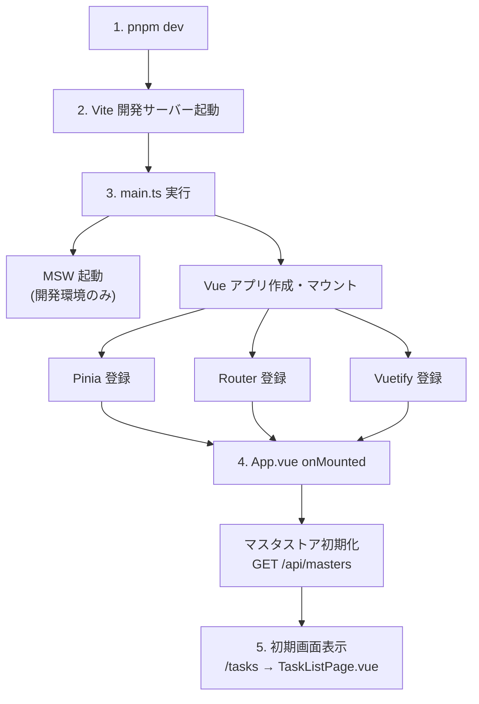
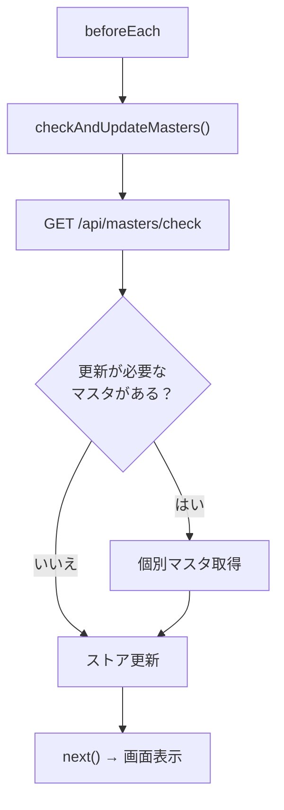

# Phase 1: 基盤構築 実装解説

このドキュメントでは、サンプルアプリの基盤構築で実施した内容を詳細に解説します。
実際のプロジェクトに適用する際の参考としてください。

---

## 目次

1. [プロジェクト初期設定](#1-プロジェクト初期設定)
2. [Vue3 + Vuetify3 エントリポイント](#2-vue3--vuetify3-エントリポイント)
3. [ルーター設定](#3-ルーター設定)
4. [型定義（Types）](#4-型定義types)
5. [マスタストア（Pinia）](#5-マスタストアpinia)
6. [MSW セットアップ](#6-msw-セットアップ)
7. [ファイル構成まとめ](#7-ファイル構成まとめ)

---

## 1. プロジェクト初期設定

### 1.1 package.json

```json
{
  "name": "task-manager-sample",
  "version": "0.0.1",
  "private": true,
  "type": "module",
  "scripts": {
    "dev": "vite",
    "build": "vue-tsc -b && vite build",
    "preview": "vite preview"
  },
  "dependencies": {
    "vue": "^3.5.13",
    "vue-router": "^4.5.0",
    "pinia": "^2.3.0",
    "vuetify": "^3.7.0",
    "@mdi/font": "^7.4.47"
  },
  "devDependencies": {
    "@vitejs/plugin-vue": "^5.2.1",
    "typescript": "~5.6.3",
    "vite": "^6.0.5",
    "vue-tsc": "^2.2.0",
    "sass": "^1.83.0",
    "msw": "^2.7.0"
  },
  "msw": {
    "workerDirectory": ["public"]
  }
}
```

**ポイント：**

| 項目 | 説明 |
|------|------|
| `"type": "module"` | ESModules を使用（import/export 構文） |
| `vue-router` | SPA のルーティング |
| `pinia` | Vue3 公式の状態管理ライブラリ |
| `vuetify` | マテリアルデザインの UI フレームワーク |
| `@mdi/font` | Material Design Icons（Vuetify で使用） |
| `msw` | API モック |
| `"msw".workerDirectory` | MSW の Service Worker 配置先 |

### 1.2 vite.config.ts

```typescript
import { defineConfig } from 'vite'
import vue from '@vitejs/plugin-vue'
import { fileURLToPath, URL } from 'node:url'

export default defineConfig({
  plugins: [vue()],
  resolve: {
    alias: {
      '@': fileURLToPath(new URL('./src', import.meta.url)),
      '@fe-libs': fileURLToPath(new URL('./fe-libs', import.meta.url)),
    },
  },
})
```

**パスエイリアスの設定：**

| エイリアス | 実際のパス | 用途 |
|-----------|-----------|------|
| `@/` | `./src/` | アプリケーションコード |
| `@fe-libs/` | `./fe-libs/` | Vue2/Vue3 共有コード |

これにより、以下のような import が可能になります：

```typescript
// Before（相対パス）
import { useMasterStore } from '../../../features/master/model/useMasterStore'

// After（エイリアス）
import { useMasterStore } from '@/features/master/model/useMasterStore'
```

### 1.3 tsconfig.json

```json
{
  "compilerOptions": {
    "target": "ES2020",
    "module": "ESNext",
    "moduleResolution": "bundler",
    "strict": true,
    "noEmit": true,
    "jsx": "preserve",
    "baseUrl": ".",
    "paths": {
      "@/*": ["src/*"],
      "@fe-libs/*": ["fe-libs/*"]
    }
  },
  "include": ["src/**/*.ts", "src/**/*.vue", "fe-libs/**/*.ts"]
}
```

**重要：** `paths` の設定は vite.config.ts の `alias` と一致させる必要があります。

---

## 2. Vue3 + Vuetify3 エントリポイント

### 2.1 main.ts（アプリケーション起動）

```typescript
// src/app/main.ts
import { createApp } from 'vue'
import { createPinia } from 'pinia'
import App from './App.vue'
import { router } from './router'
import { vuetify } from './plugins/vuetify'

// MSW を開発環境でのみ有効化
async function enableMocking() {
  if (import.meta.env.DEV) {
    const { worker } = await import('@/mocks/browser')
    return worker.start({
      onUnhandledRequest: 'bypass', // 未定義のリクエストは実際のサーバーへ
    })
  }
}

// MSW 起動後にアプリをマウント
enableMocking().then(() => {
  const app = createApp(App)

  app.use(createPinia())  // 状態管理
  app.use(router)         // ルーティング
  app.use(vuetify)        // UI フレームワーク

  app.mount('#app')
})
```

**MSW の起動タイミングが重要：**

```
1. enableMocking() で MSW を起動
2. MSW 起動完了を待つ（await / then）
3. Vue アプリをマウント
```

この順序を守らないと、初回の API 呼び出しが MSW にインターセプトされない可能性があります。

### 2.2 App.vue（ルートコンポーネント）

```vue
<script setup lang="ts">
import { onMounted } from 'vue'
import { useMasterStore } from '@/features/master/model/useMasterStore'

const { initializeMasters } = useMasterStore()

// アプリ起動時にマスタデータを取得
onMounted(async () => {
  await initializeMasters()
})
</script>

<template>
  <v-app>
    <v-main>
      <router-view />
    </v-main>
  </v-app>
</template>
```

**Vuetify の必須構造：**

```
v-app          ← Vuetify アプリのルート（必須）
└── v-main     ← メインコンテンツ領域
    └── router-view  ← ページコンポーネントの表示場所
```

### 2.3 vuetify.ts（Vuetify プラグイン設定）

```typescript
// src/app/plugins/vuetify.ts
import 'vuetify/styles'
import '@mdi/font/css/materialdesignicons.css'
import { createVuetify } from 'vuetify'
import * as components from 'vuetify/components'
import * as directives from 'vuetify/directives'

export const vuetify = createVuetify({
  components,
  directives,
  theme: {
    defaultTheme: 'light',
    themes: {
      light: {
        colors: {
          primary: '#1976D2',
          secondary: '#424242',
          accent: '#82B1FF',
          error: '#FF5252',
          info: '#2196F3',
          success: '#4CAF50',
          warning: '#FFC107',
        },
      },
    },
  },
  defaults: {
    // コンポーネントのデフォルト設定
    VBtn: {
      variant: 'flat',
    },
    VTextField: {
      variant: 'outlined',
      density: 'comfortable',
    },
    VSelect: {
      variant: 'outlined',
      density: 'comfortable',
    },
  },
})
```

**設定のポイント：**

| 項目 | 説明 |
|------|------|
| `components` | 全コンポーネントをインポート（Tree-shaking は Vite が行う） |
| `theme.colors` | アプリ全体のカラーパレット |
| `defaults` | 各コンポーネントのデフォルト props |

---

## 3. ルーター設定

### 3.1 router/index.ts

```typescript
// src/app/router/index.ts
import { createRouter, createWebHistory } from 'vue-router'
import type { RouteRecordRaw } from 'vue-router'
import { useMasterStore } from '@/features/master/model/useMasterStore'

const routes: RouteRecordRaw[] = [
  {
    path: '/',
    redirect: '/tasks',
  },
  {
    path: '/tasks',
    name: 'task-list',
    // 遅延読み込み（コード分割）
    component: () => import('@/pages/tasks/TaskListPage.vue'),
  },
  {
    path: '/tasks/new',
    name: 'task-create',
    component: () => import('@/pages/tasks/TaskCreatePage.vue'),
  },
  {
    path: '/tasks/:id/edit',
    name: 'task-edit',
    component: () => import('@/pages/tasks/TaskEditPage.vue'),
  },
]

export const router = createRouter({
  history: createWebHistory(),
  routes,
})

// ナビゲーションガード：画面遷移時にマスタ更新チェック
router.beforeEach(async (_to, _from, next) => {
  const { checkAndUpdateMasters, initialized } = useMasterStore()

  // 初期化済みの場合のみマスタ更新チェック
  if (initialized.value) {
    await checkAndUpdateMasters()
  }

  next()
})
```

**遅延読み込み（Lazy Loading）：**

```typescript
// ❌ 静的インポート（全ページが初期バンドルに含まれる）
import TaskListPage from '@/pages/tasks/TaskListPage.vue'

// ✅ 動的インポート（アクセス時に読み込み）
component: () => import('@/pages/tasks/TaskListPage.vue')
```

**ナビゲーションガードの活用：**

```typescript
router.beforeEach(async (to, from, next) => {
  // 画面遷移前に実行される処理
  // - 認証チェック
  // - マスタ更新チェック
  // - アクセス権限チェック
  next()  // 遷移を続行
})
```

---

## 4. 型定義（Types）

### 4.1 型定義の配置方針

型定義は**見通しの良さと実プロジェクト構成を両立**させるため、以下の方針を採用しています：

```
fe-libs/types/                        ← 実装・一元管理
├── index.ts
├── tasks.ts                          （Vue2/Vue3で共有）
└── masters.ts

src/features/tasks/
├── types/
│   └── index.ts                      ← fe-libs/types を再エクスポート
├── model/
│   └── useTaskList.ts                ← @/features/tasks/types からインポート
└── ...

src/features/master/
├── types/
│   └── index.ts                      ← fe-libs/types を再エクスポート
├── model/
│   └── masterStore.ts                ← @/features/master/types からインポート
└── ...
```

**再エクスポート方式のメリット：**
- ✅ **見通しの良さ**：型定義が機能の近くにある
- ✅ **一元管理**：実装は `fe-libs/types/` で統一
- ✅ **Vue2/Vue3共有**：`@fe-libs/types` から両方がインポート可能
- ✅ **保守性**：型定義追加時の変更箇所が最小限

### 4.2 マスタ型定義

```typescript
// fe-libs/types/masters.ts

/** 作業者マスタ */
export interface Worker {
  id: string
  name: string
  department: string
}

/** 機械マスタ */
export interface Machine {
  id: string
  name: string
  category: string
}

/** 材料マスタ */
export interface Material {
  id: string
  name: string
  category: string
}

/** 単位マスタ */
export interface Unit {
  id: string
  name: string
  symbol: string
}

/** マスタ種別（Union Type） */
export type MasterType = 'workers' | 'machines' | 'materials' | 'units'

/** マスタバージョン */
export interface MasterVersions {
  workers: string
  machines: string
  materials: string
  units: string
}

/** 全マスタ取得レスポンス */
export interface MastersResponse {
  workers: Worker[]
  machines: Machine[]
  materials: Material[]
  units: Unit[]
  versions: MasterVersions
}

/** マスタ更新チェックレスポンス */
export interface MasterCheckResponse {
  updatedMasters: MasterType[]
}
```

**型定義のベストプラクティス：**

| パターン | 説明 |
|---------|------|
| `interface` | オブジェクトの形状を定義 |
| `type` (Union) | 取りうる値の集合を定義 |
| JSDoc コメント | エディタでホバー時に説明が表示される |

### 4.3 再エクスポート

各機能の `types/index.ts` から `fe-libs/types` を再エクスポート：

```typescript
// src/features/master/types/index.ts
export * from '@fe-libs/types'
```

これにより、以下が実現されます：

```typescript
// masterStore.ts
import type {
  Worker,
  Machine,
  Material,
  Unit,
  MasterVersions,
  MasterType,
  MastersResponse,
  MasterCheckResponse,
} from '../types'  // 近い・見通し良い
```

### 4.4 タスク型定義

```typescript
// fe-libs/types/tasks.ts

/** タスクに紐づく材料（使用量付き） */
export interface TaskMaterial {
  id: string
  name: string
  amount: number
  unitId: string
  unitName: string
}

/** タスク */
export interface Task {
  id: string
  workDate: string           // ISO 8601 形式
  workers: TaskWorker[]      // 複数選択
  machine: TaskMachine       // 単一選択
  materials: TaskMaterial[]  // 複数選択 + 付随データ
  createdAt: string
  updatedAt: string
}

/** タスク一覧レスポンス（ページング対応） */
export interface TaskListResponse {
  items: Task[]
  total: number
  page: number
  limit: number
  totalPages: number
}

/** タスク登録リクエスト */
export interface CreateTaskRequest {
  workDate: string
  workerIds: string[]        // ID のみ送信
  machineId: string
  materials: CreateTaskMaterial[]
}

interface CreateTaskMaterial {
  id: string
  amount: number
  unitId: string
}
```

**API レスポンス型とリクエスト型を分ける理由：**

```typescript
// レスポンス: 名前などの表示用データを含む
interface TaskMaterial {
  id: string
  name: string      // ← 表示用
  amount: number
  unitId: string
  unitName: string  // ← 表示用
}

// リクエスト: ID のみ送信（名前はサーバー側で解決）
interface CreateTaskMaterial {
  id: string
  amount: number
  unitId: string
  // name, unitName は不要
}
```

---

## 5. マスタストア（Pinia）

### 5.1 ストア定義（masterStore.ts）

```typescript
// src/features/master/model/masterStore.ts
import { defineStore } from 'pinia'
import { ref } from 'vue'
import type {
  Worker,
  Machine,
  Material,
  Unit,
  MasterVersions,
  MasterType,
  MastersResponse,
  MasterCheckResponse,
} from '../types'

export const useMasterStoreInternal = defineStore('master', () => {
  // ===================================
  // State（リアクティブな状態）
  // ===================================
  const workers = ref<Worker[]>([])
  const machines = ref<Machine[]>([])
  const materials = ref<Material[]>([])
  const units = ref<Unit[]>([])
  const versions = ref<MasterVersions>({
    workers: '',
    machines: '',
    materials: '',
    units: '',
  })
  const initialized = ref(false)
  const loading = ref(false)

  // ===================================
  // Actions（状態を変更する関数）
  // ===================================

  /**
   * 全マスタを取得して初期化
   */
  async function initialize(): Promise<void> {
    // 二重初期化を防止
    if (initialized.value) return

    loading.value = true
    try {
      const response = await fetch('/api/masters')
      if (!response.ok) {
        throw new Error('Failed to fetch masters')
      }

      const data: MastersResponse = await response.json()

      // State を更新
      workers.value = data.workers
      machines.value = data.machines
      materials.value = data.materials
      units.value = data.units
      versions.value = data.versions
      initialized.value = true
    } catch (error) {
      console.error('Failed to initialize masters:', error)
      throw error
    } finally {
      loading.value = false
    }
  }

  /**
   * マスタ更新チェックと差分更新
   */
  async function checkAndUpdate(): Promise<void> {
    if (!initialized.value) return

    try {
      // 現在のバージョンをクエリパラメータで送信
      const params = new URLSearchParams({
        workersVersion: versions.value.workers,
        machinesVersion: versions.value.machines,
        materialsVersion: versions.value.materials,
        unitsVersion: versions.value.units,
      })

      const response = await fetch(`/api/masters/check?${params}`)
      if (!response.ok) {
        throw new Error('Failed to check masters')
      }

      const data: MasterCheckResponse = await response.json()

      // 更新が必要なマスタのみ個別取得
      for (const masterType of data.updatedMasters) {
        await fetchMaster(masterType)
      }
    } catch (error) {
      console.error('Failed to check and update masters:', error)
    }
  }

  /**
   * 個別マスタ取得
   */
  async function fetchMaster(type: MasterType): Promise<void> {
    const response = await fetch(`/api/masters/${type}`)
    if (!response.ok) {
      throw new Error(`Failed to fetch ${type}`)
    }

    const data = await response.json()

    // 型に応じて適切な State を更新
    switch (type) {
      case 'workers':
        workers.value = data.workers
        versions.value.workers = data.version
        break
      case 'machines':
        machines.value = data.machines
        versions.value.machines = data.version
        break
      case 'materials':
        materials.value = data.materials
        versions.value.materials = data.version
        break
      case 'units':
        units.value = data.units
        versions.value.units = data.version
        break
    }
  }

  return {
    // State
    workers,
    machines,
    materials,
    units,
    versions,
    initialized,
    loading,
    // Actions
    initialize,
    checkAndUpdate,
    fetchMaster,
  }
})
```

**Pinia の Composition API スタイル：**

```typescript
export const useMyStore = defineStore('storeName', () => {
  // ref() で State を定義
  const count = ref(0)

  // 関数で Actions を定義
  function increment() {
    count.value++
  }

  // computed() で Getters を定義
  const double = computed(() => count.value * 2)

  // 公開するものを return
  return { count, increment, double }
})
```

### 5.2 Composable（useMasterStore.ts）

```typescript
// src/features/master/model/useMasterStore.ts
import { computed } from 'vue'
import { storeToRefs } from 'pinia'
import { useMasterStoreInternal } from './masterStore'

/**
 * マスタストアを利用するための Composable
 *
 * 使用例:
 * ```ts
 * const { workers, machines, loading, initializeMasters } = useMasterStore()
 * ```
 */
export function useMasterStore() {
  const store = useMasterStoreInternal()

  // storeToRefs でリアクティブ性を維持したまま分割代入
  const { workers, machines, materials, units, initialized, loading } =
    storeToRefs(store)

  return {
    // State（リアクティブな参照）
    workers: computed(() => workers.value),
    machines: computed(() => machines.value),
    materials: computed(() => materials.value),
    units: computed(() => units.value),
    initialized: computed(() => initialized.value),
    loading: computed(() => loading.value),

    // Actions
    initializeMasters: () => store.initialize(),
    checkAndUpdateMasters: () => store.checkAndUpdate(),

    // ヘルパー関数: IDから名前を取得
    getWorkerName: (id: string) =>
      workers.value.find((w) => w.id === id)?.name ?? '',
    getMachineName: (id: string) =>
      machines.value.find((m) => m.id === id)?.name ?? '',
    getMaterialName: (id: string) =>
      materials.value.find((m) => m.id === id)?.name ?? '',
    getUnitName: (id: string) =>
      units.value.find((u) => u.id === id)?.name ?? '',
    getUnitSymbol: (id: string) =>
      units.value.find((u) => u.id === id)?.symbol ?? '',
  }
}
```

**なぜ Composable でラップするのか：**

```typescript
// ❌ コンポーネントから直接ストアを使う
const store = useMasterStoreInternal()
const name = store.workers.find(w => w.id === id)?.name

// ✅ Composable 経由で使う
const { workers, getWorkerName } = useMasterStore()
const name = getWorkerName(id)
```

利点：
1. **使いやすい API**: ヘルパー関数で頻出処理をまとめられる
2. **変更に強い**: ストアの内部構造が変わっても Composable の API は維持できる
3. **テストしやすい**: Composable 単位でモック可能

---

## 6. MSW セットアップ

### 6.1 ディレクトリ構成

```
sample/
├── src/
│   └── mocks/
│       └── browser.ts       # MSW 初期化（アプリ側）
│
└── fe-libs/
    └── mocks/
        ├── handlers/        # API ハンドラー
        │   ├── index.ts
        │   ├── masters.handlers.ts
        │   └── tasks.handlers.ts
        └── fixtures/        # レスポンスデータ
            └── masters/
                ├── index.ts         # fixtures 一括エクスポート
                ├── workers.ts
                ├── machines.ts
                ├── materials.ts
                └── units.ts
```

**分離の理由：**

| 場所 | 内容 | 理由 |
|------|------|------|
| `src/mocks/` | MSW の初期化のみ | アプリ固有の設定 |
| `fe-libs/mocks/` | Handler / Fixture | Vue2/Vue3 で共有可能 |

### 6.2 browser.ts（MSW 初期化）

```typescript
// src/mocks/browser.ts
import { setupWorker } from 'msw/browser'
import { handlers } from '@fe-libs/mocks/handlers'

export const worker = setupWorker(...handlers)
```

**これだけ！** 初期化コードは非常にシンプルです。

### 6.3 Fixture の書き方

```typescript
// fe-libs/mocks/fixtures/masters/workers.ts

// 型をローカルに定義（fe-libs は src に依存しない）
export interface Worker {
  id: string
  name: string
  department: string
}

// Fixture データ
export const workersFixture: Worker[] = [
  { id: 'w001', name: '山田 太郎', department: '製造部' },
  { id: 'w002', name: '鈴木 花子', department: '製造部' },
  { id: 'w003', name: '佐藤 次郎', department: '製造部' },
  { id: 'w004', name: '田中 美咲', department: '品質管理部' },
  { id: 'w005', name: '高橋 健一', department: '品質管理部' },
  { id: 'w006', name: '伊藤 さくら', department: '開発部' },
  { id: 'w007', name: '渡辺 大輔', department: '開発部' },
  { id: 'w008', name: '中村 優子', department: '総務部' },
]

// バージョン管理用
export const workersVersion = 'v1.0.0'
```

**Fixture のポイント：**

1. **API レスポンスと完全一致** させる
2. **型をローカルに定義** して fe-libs の独立性を保つ
3. **バージョン** を付けて更新チェックに対応

#### fixtures/masters/index.ts

```typescript
// fe-libs/mocks/fixtures/masters/index.ts
export * from './workers'
export * from './machines'
export * from './materials'
export * from './units'
```

**一括エクスポートのメリット：**
- handler からのインポートが簡潔になる
- 新しい fixture を追加した際の変更箇所が1つで済む

### 6.4 Handler の書き方

```typescript
// fe-libs/mocks/handlers/masters.handlers.ts
import { http, HttpResponse } from 'msw'
import {
  workersFixture,
  workersVersion,
  machinesFixture,
  machinesVersion,
  materialsFixture,
  materialsVersion,
  unitsFixture,
  unitsVersion,
} from '../fixtures/masters'

/**
 * GET /api/masters - 全マスタ取得
 */
export const getMastersHandler = http.get('/api/masters', () => {
  return HttpResponse.json({
    workers: workersFixture,
    machines: machinesFixture,
    materials: materialsFixture,
    units: unitsFixture,
    versions: {
      workers: workersVersion,
      machines: machinesVersion,
      materials: materialsVersion,
      units: unitsVersion,
    },
  })
})

/**
 * GET /api/masters/check - マスタ更新チェック
 * 常に「更新なし」を返す（デフォルト動作）
 */
export const checkMastersHandler = http.get('/api/masters/check', () => {
  return HttpResponse.json({
    updatedMasters: [],
  })
})

/**
 * GET /api/masters/workers - 作業者マスタ取得
 */
export const getWorkersHandler = http.get('/api/masters/workers', () => {
  return HttpResponse.json({
    workers: workersFixture,
    version: workersVersion,
  })
})

// 他のマスタも同様...

// Handler のエクスポート
export const mastersHandlers = [
  getMastersHandler,
  checkMastersHandler,
  getWorkersHandler,
  getMachinesHandler,
  getMaterialsHandler,
  getUnitsHandler,
]
```

**Handler のパターン：**

```typescript
// 基本形
http.get('/api/path', () => {
  return HttpResponse.json({ data: 'value' })
})

// パスパラメータあり
http.get('/api/items/:id', ({ params }) => {
  const { id } = params
  return HttpResponse.json({ id, name: 'Item' })
})

// クエリパラメータあり
http.get('/api/items', ({ request }) => {
  const url = new URL(request.url)
  const page = url.searchParams.get('page') || '1'
  return HttpResponse.json({ page })
})

// POST（リクエストボディあり）
http.post('/api/items', async ({ request }) => {
  const body = await request.json()
  return HttpResponse.json({ id: '1', ...body }, { status: 201 })
})

// エラーレスポンス
http.get('/api/error', () => {
  return HttpResponse.json(
    { message: 'Not Found' },
    { status: 404 }
  )
})
```

### 6.5 handlers/index.ts（集約）

```typescript
// fe-libs/mocks/handlers/index.ts
import { mastersHandlers } from './masters.handlers'
import { tasksHandlers } from './tasks.handlers'

export const handlers = [
  ...mastersHandlers,
  ...tasksHandlers,
]
```

---

## 7. ファイル構成まとめ

### 7.1 最終的なディレクトリ構造

```
sample/
├── index.html
├── package.json
├── tsconfig.json
├── vite.config.ts
│
├── public/
│   └── mockServiceWorker.js    # MSW が自動生成
│
├── src/
│   ├── vite-env.d.ts           # 型宣言
│   │
│   ├── app/
│   │   ├── main.ts             # エントリポイント
│   │   ├── App.vue             # ルートコンポーネント
│   │   ├── router/
│   │   │   └── index.ts        # ルーター設定
│   │   └── plugins/
│   │       └── vuetify.ts      # Vuetify 設定
│   │
│   ├── pages/
│   │   └── tasks/
│   │       ├── TaskListPage.vue
│   │       ├── TaskCreatePage.vue
│   │       └── TaskEditPage.vue
│   │
│   ├── features/
│   │   ├── master/
│   │   │   ├── types/
│   │   │   │   └── index.ts
│   │   │   └── model/
│   │   │       ├── masterStore.ts
│   │   │       └── useMasterStore.ts
│   │   └── tasks/
│   │       └── types/
│   │           └── index.ts
│   │
│   └── mocks/
│       └── browser.ts          # MSW 初期化
│
└── fe-libs/
    └── mocks/
        ├── handlers/
        │   ├── index.ts
        │   ├── masters.handlers.ts
        │   └── tasks.handlers.ts
        └── fixtures/
            └── masters/
                ├── index.ts            # 一括エクスポート
                ├── workers.ts
                ├── machines.ts
                ├── materials.ts
                └── units.ts
```

### 7.2 起動フロー



### 7.3 データフロー

**画面遷移時のマスタ更新チェック：**



**コンポーネントからマスタ参照：**

```vue
<script setup>
const { workers, getWorkerName } = useMasterStore()
</script>

<template>
  <v-select :items="workers" />
  <span>{{ getWorkerName(task.workerId) }}</span>
</template>
```

---

## 次のステップ

Phase 1 の基盤構築が完了しました。次は **Phase 2: 一覧画面** に進みます。

- TaskListWidget の実装
- TaskTableSection の実装
- タスク一覧 fixture / handler の作成
- ページネーションの実装

---

## 更新履歴

| 日付 | 版 | 内容 |
|------|-----|------|
| 2026/01/15 | 1.2 | 型定義の再エクスポート方式を採用 |
| 2026/01/14 | 1.1 | fixtures/masters/index.ts 追加に対応 |
| 2026/01/12 | 1.0 | 初版作成 |
