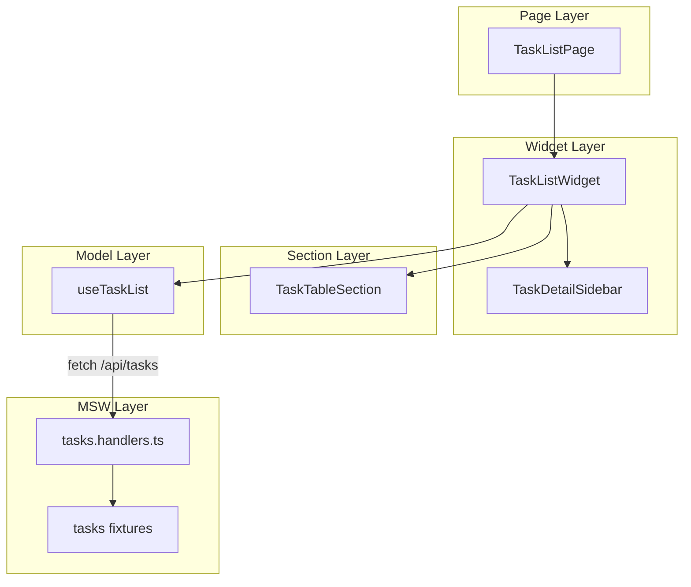
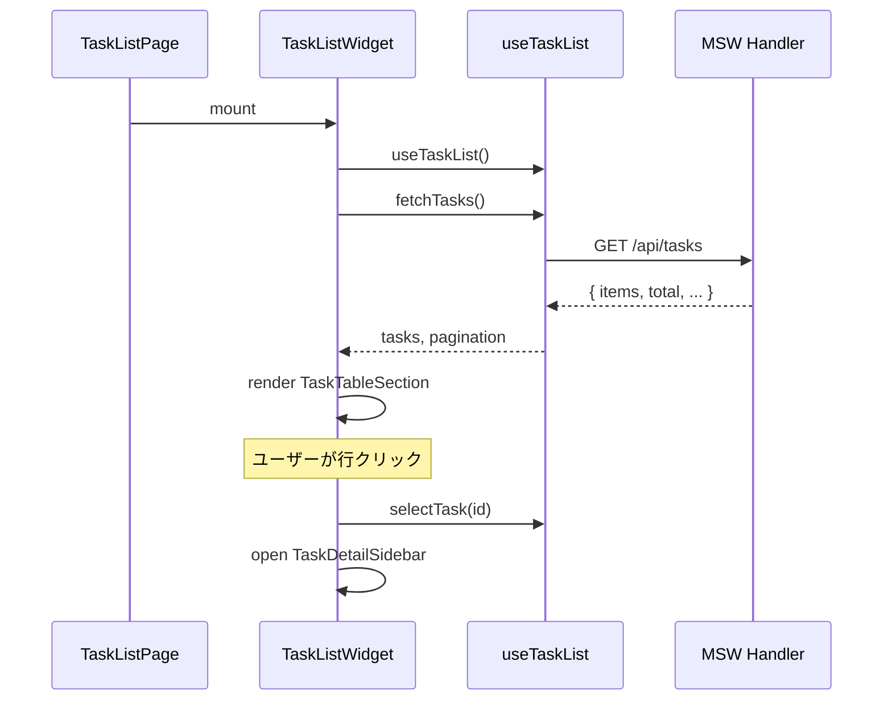

# Phase 2: タスク一覧画面 実装解説

## 📌 このフェーズで実装した内容

- **タスク一覧テーブル**（ソート機能付き）
- **ページネーション**（表示件数変更対応）
- **タスク詳細サイドバー**
- **タスク用MSW fixtures/handlers**

---

## 🏗️ 作成ファイル一覧

```
sample/
├── fe-libs/mocks/
│   ├── fixtures/tasks/
│   │   ├── index.ts             # fixtures エクスポート
│   │   ├── tasks.normal.ts      # 15件の通常データ
│   │   └── tasks.large.ts       # 100件のページネーションテスト用
│   └── handlers/
│       └── tasks.handlers.ts    # 更新: GET/POST/PUT/DELETE 完全実装
│
├── src/widgets/tasks/
│   ├── index.ts                 # widgets エクスポート
│   ├── TaskListWidget/          # 一覧画面Widget（Container）
│   │   ├── TaskListWidget.vue
│   │   └── index.ts
│   └── TaskDetailSidebar/       # 詳細表示サイドバー
│       ├── TaskDetailSidebar.vue
│       └── index.ts
│
├── src/sections/tasks/
│   ├── index.ts                 # sections エクスポート
│   └── TaskTableSection/        # テーブル表示（Presentational）
│       ├── TaskTableSection.vue
│       ├── TaskTableSection.stories.ts
│       └── index.ts
│
├── src/features/tasks/
│   └── model/
│       ├── index.ts             # model エクスポート
│       └── useTaskList.ts       # 一覧管理 Composable
│
└── src/pages/tasks/
    └── TaskListPage.vue         # 更新: Widget を配置
```

---

## 📐 アーキテクチャ図



---

## 🔍 各コンポーネント解説

### 1. TaskTableSection（Presentational Component）

**責務:** データ表示に特化した純粋なUIコンポーネント

```vue
<script setup lang="ts">
// Props で受け取り、Events で通知するだけ
interface Props {
  tasks: Task[]
  isLoading?: boolean
  selectedTaskId?: string | null
  sortBy?: string
  sortOrder?: 'asc' | 'desc'
}

const emit = defineEmits<{
  'click:row': [taskId: string]
  'update:sort': [sortBy: string]
}>()
</script>
```

**設計ポイント:**
- API呼び出しや状態管理を持たない
- 表示ロジック（formatWorkers, formatDate など）のみ
- 再利用可能なテーブルコンポーネント

---

### 2. TaskDetailSidebar（Presentational Component）

**責務:** 選択されたタスクの詳細表示

```vue
<script setup lang="ts">
interface Props {
  task: Task | null
  isOpen?: boolean
}

const emit = defineEmits<{
  close: []
  edit: [taskId: string]
}>()
</script>
```

**設計ポイント:**
- Vuetify の `v-navigation-drawer` を利用
- 編集ボタンは emit で親に通知するだけ
- 遷移ロジックは Widget 層で管理

---

### 3. TaskListWidget（Container Component）

**責務:** ビジネスロジックとUIの接続

```vue
<script setup lang="ts">
import { useTaskList } from '@/features/tasks/model/useTaskList'
import { TaskTableSection } from '@/sections/tasks/TaskTableSection'
import { TaskDetailSidebar } from '@/widgets/tasks/TaskDetailSidebar'

// Composable でロジックを取得
const {
  tasks,
  isLoading,
  pagination,
  fetchTasks,
  changePage,
  changeSort,
  selectTask,
} = useTaskList()

// イベントハンドラでロジックを呼び出し
function handleRowClick(taskId: string) {
  selectTask(taskId)
  isSidebarOpen.value = true
}
</script>
```

**設計ポイント:**
- Composable からロジックを取得
- Presentational Components を配置
- ページ遷移やサイドバー開閉を管理

---

### 4. useTaskList（Composable）⭐ 最重要

**責務:** タスク一覧画面のビジネスロジックを一元管理

Composable は CDD 設計の「心臓部」であり、**状態の唯一の真実（Single Source of Truth）** を持ちます。
Widget や Section から直接 API を呼んだり、状態を持つことは禁止されています。

#### 4-1. 全体構成

```typescript
export function useTaskList() {
  // ===================================
  // State（状態）
  // ===================================
  const tasks = ref<Task[]>([])
  const isLoading = ref(false)
  const error = ref<Error | null>(null)
  const selectedTaskId = ref<string | null>(null)
  const page = ref(1)
  const limit = ref(10)
  const sortBy = ref<string>('workDate')
  const sortOrder = ref<'asc' | 'desc'>('desc')

  // ===================================
  // Computed（導出値）
  // ===================================
  const selectedTask = computed(() => { ... })
  const pagination = computed(() => { ... })

  // ===================================
  // Actions（操作）
  // ===================================
  async function fetchTasks() { ... }
  function changePage(newPage: number) { ... }
  function changeSort(newSortBy: string) { ... }
  // ... 他の Actions

  // ===================================
  // Watchers（監視）
  // ===================================
  watch([page, sortBy, sortOrder, limit], () => fetchTasks())

  // ===================================
  // Return（公開インターフェース）
  // ===================================
  return {
    // State
    tasks, isLoading, error, selectedTaskId,
    // Computed
    selectedTask, pagination,
    // Actions
    fetchTasks, changePage, changeSort, ...
  }
}
```

#### 4-2. State 一覧

| State | 型 | 説明 |
|-------|---|------|
| `tasks` | `Task[]` | タスク一覧データ |
| `isLoading` | `boolean` | ローディング中フラグ |
| `error` | `Error \| null` | エラー情報 |
| `selectedTaskId` | `string \| null` | 選択中のタスクID |
| `page` | `number` | 現在のページ番号 |
| `limit` | `number` | 1ページあたりの表示件数 |
| `total` | `number` | 全件数（API から取得） |
| `totalPages` | `number` | 総ページ数（API から取得） |
| `sortBy` | `string` | ソートキー |
| `sortOrder` | `'asc' \| 'desc'` | ソート順 |

#### 4-3. Computed 一覧

| Computed | 戻り値 | 説明 |
|----------|-------|------|
| `selectedTask` | `Task \| null` | `selectedTaskId` に対応するタスクオブジェクト |
| `query` | `TaskListQuery` | API リクエスト用のクエリパラメータ |
| `pagination` | `object` | ページネーション情報（page, limit, total, hasNext, hasPrev） |

#### 4-4. Actions 一覧 ⭐

Actions は **State を変更する唯一の手段** です。Widget からは Actions を呼び出すだけで、直接 State を変更しません。

| Action | 引数 | 説明 |
|--------|-----|------|
| `fetchTasks()` | なし | API からタスク一覧を取得し、State を更新 |
| `changePage(newPage)` | `number` | ページを変更（選択もクリア） |
| `nextPage()` | なし | 次のページへ移動 |
| `prevPage()` | なし | 前のページへ移動 |
| `changeSort(sortBy)` | `string` | ソートキーを変更（同じキーなら順序反転） |
| `selectTask(taskId)` | `string \| null` | タスクを選択（サイドバー表示用） |
| `clearSelection()` | なし | 選択を解除 |
| `changeLimit(newLimit)` | `number` | 表示件数を変更（ページは1に戻る） |

#### 4-5. 各 Action の詳細

##### `fetchTasks()` - データ取得

```typescript
async function fetchTasks() {
  isLoading.value = true
  error.value = null

  try {
    const params = new URLSearchParams({
      page: String(page.value),
      limit: String(limit.value),
      sortBy: sortBy.value,
      sortOrder: sortOrder.value,
    })

    const response = await fetch(`/api/tasks?${params}`)
    if (!response.ok) {
      throw new Error(`HTTP error: ${response.status}`)
    }

    const data: TaskListResponse = await response.json()
    tasks.value = data.items
    total.value = data.total
    totalPages.value = data.totalPages
  } catch (e) {
    error.value = e instanceof Error ? e : new Error(String(e))
    tasks.value = []
  } finally {
    isLoading.value = false
  }
}
```

**ポイント:**
- `isLoading` で UI にローディング状態を伝える
- `error` でエラー状態を管理（UI でアラート表示可能）
- `finally` で必ず `isLoading` を解除

##### `changePage(newPage)` - ページ変更

```typescript
function changePage(newPage: number) {
  if (newPage < 1 || newPage > totalPages.value) return
  page.value = newPage
  selectedTaskId.value = null // 選択をクリア
}
```

**ポイント:**
- 範囲外のページは無視（ガード条件）
- ページ変更時に選択をクリア（UX 考慮）

##### `changeSort(newSortBy)` - ソート変更

```typescript
function changeSort(newSortBy: string) {
  if (sortBy.value === newSortBy) {
    // 同じカラムなら順序を反転
    sortOrder.value = sortOrder.value === 'asc' ? 'desc' : 'asc'
  } else {
    sortBy.value = newSortBy
    sortOrder.value = 'desc' // 新しいカラムはデフォルトで降順
  }
  page.value = 1 // ページを1に戻す
  selectedTaskId.value = null
}
```

**ポイント:**
- 同じカラムクリックで昇順/降順を切り替え
- ソート変更時はページ1に戻す（一般的なUXパターン）

##### `selectTask(taskId)` - タスク選択

```typescript
function selectTask(taskId: string | null) {
  selectedTaskId.value = taskId
}
```

**ポイント:**
- シンプルに ID をセットするだけ
- `null` を渡すと選択解除
- Widget 側でサイドバーの開閉を制御

#### 4-6. Watchers

```typescript
watch([page, sortBy, sortOrder, limit], () => {
  fetchTasks()
})
```

**ポイント:**
- State の変更を監視して自動で `fetchTasks()` を実行
- Widget から `changePage()` を呼ぶだけで、API 再取得まで自動で行われる
- 初回ロードは `onMounted` で Widget から `fetchTasks()` を呼ぶ

#### 4-7. 設計原則まとめ

| 原則 | 説明 |
|------|------|
| **Single Source of Truth** | 状態は Composable にのみ存在 |
| **Actions 経由の更新** | State は Actions からのみ変更 |
| **Computed で導出** | 派生値は computed で計算 |
| **Watch で副作用** | State 変更時の自動処理は watch で |
| **純粋な関数** | Vue コンポーネントに依存しない TypeScript 関数 |

---

## 🔌 MSW Handler 実装

### tasks.handlers.ts の主要実装

```typescript
// インメモリデータストア
let tasksData: TaskFixture[] = [...tasksNormalFixture]

export const getTasksHandler = http.get('/api/tasks', async ({ request }) => {
  await delay(200) // リアルなAPI体験
  
  const url = new URL(request.url)
  const page = parseInt(url.searchParams.get('page') || '1')
  const limit = parseInt(url.searchParams.get('limit') || '10')
  
  // ソート処理
  const sortedData = [...tasksData].sort(...)
  
  // ページネーション
  const items = sortedData.slice(start, start + limit)
  
  return HttpResponse.json({
    items,
    total: tasksData.length,
    page,
    limit,
    totalPages: Math.ceil(total / limit),
  })
})
```

---

## 📊 データフロー図



---

## ✅ Phase 2 で学べるパターン

| パターン | 適用箇所 | 説明 |
|---------|---------|------|
| **Presentational / Container 分離** | Table / Widget | 表示とロジックを分離 |
| **Composable パターン** | useTaskList | 再利用可能なロジック |
| **Props Down, Events Up** | 全コンポーネント | 単方向データフロー |
| **インメモリストア** | MSW handlers | テスト用データ操作 |

---

## 🚀 次の Phase 3: 新規登録・編集画面

Phase 3 では以下を実装予定：

1. **TaskCreatePage** - 新規タスク登録画面
2. **TaskEditPage** - タスク編集画面
3. **TaskForm** - 共通フォームコンポーネント
4. **useTaskForm** - フォーム管理 Composable
5. **バリデーション** - フロントエンドバリデーション
