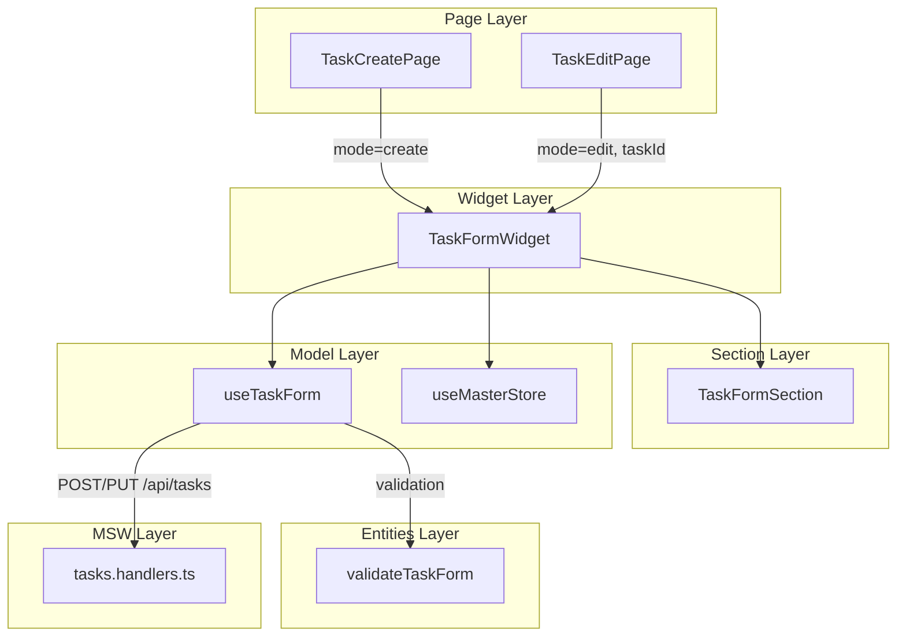
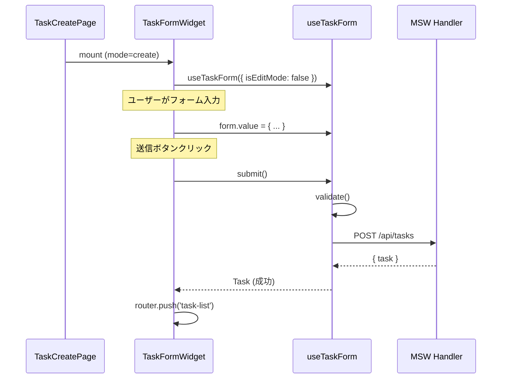
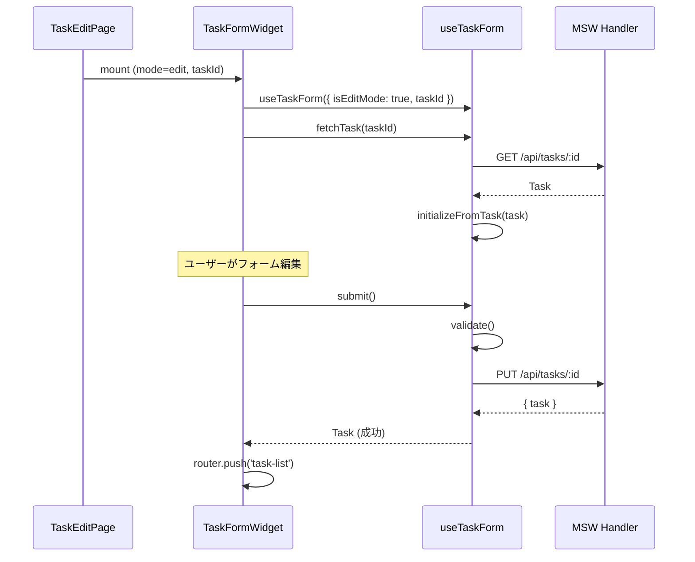

# Phase 3: 新規登録・編集画面 実装解説

## 📌 このフェーズで実装した内容

- **タスク新規登録フォーム**
- **タスク編集フォーム**（既存データの読み込み・更新）
- **フォームバリデーション**
- **フォーム管理 Composable**（`useTaskForm`）

---

## 🏗️ 作成ファイル一覧

```
sample/
├── src/entities/
│   └── task/
│       ├── validate.ts          # バリデーション純粋関数
│       └── index.ts
│
├── src/widgets/tasks/
│   ├── TaskFormWidget/          # フォームWidget（Container）
│   │   ├── TaskFormWidget.vue
│   │   └── index.ts
│   └── index.ts                 # widgets エクスポート
│
├── src/sections/tasks/
│   ├── TaskFormSection/         # フォームUI（Presentational）
│   │   ├── TaskFormSection.vue
│   │   ├── TaskFormSection.stories.ts
│   │   └── index.ts
│   └── index.ts                 # sections エクスポート
│
├── src/features/tasks/
│   └── model/
│       └── useTaskForm.ts       # フォーム管理 Composable
│
└── src/pages/tasks/
    ├── TaskCreatePage.vue       # 新規登録画面
    └── TaskEditPage.vue         # 編集画面
```

---

## 📐 アーキテクチャ図



---

## 🔍 各コンポーネント解説

### 1. TaskFormSection（Presentational Component）

**責務:** フォーム入力 UI に特化

```vue
<script setup lang="ts">
interface Props {
  form: TaskFormValues
  errors: TaskFormErrors
  workers: Worker[]
  machines: Machine[]
  materials: Material[]
  units: Unit[]
  isSubmitting?: boolean
}

const emit = defineEmits<{
  'update:form': [form: TaskFormValues]
  'add:material': []
  'remove:material': [index: number]
}>()
</script>
```

**設計ポイント:**
- マスタデータは props で受け取る（API は呼ばない）
- フォーム値の変更は `update:form` で親に通知
- バリデーションロジックは持たない

---

### 2. TaskFormWidget（Container Component）

**責務:** フォームロジックと UI の接続

```vue
<script setup lang="ts">
import { useTaskForm } from '@/features/tasks/model/useTaskForm'
import { useMasterStore } from '@/features/master/model/useMasterStore'
import { TaskFormSection } from '@/sections/tasks/TaskFormSection'

const props = defineProps<{
  mode: 'create' | 'edit'
  taskId?: string
}>()

const { form, errors, submit, ... } = useTaskForm({
  isEditMode: props.mode === 'edit',
  taskId: props.taskId,
})

const { workers, machines, materials, units } = useMasterStore()
</script>
```

**設計ポイント:**
- `mode` prop で新規/編集を切り替え
- 編集モード時は `onMounted` でタスクを取得
- 送信成功時は一覧画面へ遷移

---

### 3. useTaskForm（Composable）⭐ 最重要

**責務:** フォームのビジネスロジックを一元管理

#### 3-1. State 一覧

| State | 型 | 説明 |
|-------|---|------|
| `form` | `TaskFormValues` | フォーム入力値 |
| `errors` | `TaskFormErrors` | バリデーションエラー |
| `isSubmitting` | `boolean` | 送信中フラグ |
| `isLoadingTask` | `boolean` | タスク読み込み中（編集モード） |
| `isDirty` | `boolean` | フォームが変更されたか |
| `submitSuccess` | `boolean` | 送信成功フラグ |
| `originalTask` | `Task \| null` | 編集対象の元データ |

#### 3-2. Computed 一覧

| Computed | 戻り値 | 説明 |
|----------|-------|------|
| `isValid` | `boolean` | バリデーションが通っているか |
| `canSubmit` | `boolean` | 送信可能か（送信中でない & 変更あり） |
| `hasMaterials` | `boolean` | 材料が追加されているか |
| `requestData` | `CreateTaskRequest` | API リクエスト用のデータ |

#### 3-3. Actions 一覧 ⭐

| Action | 引数 | 説明 |
|--------|-----|------|
| `resetForm()` | なし | フォームを初期状態にリセット |
| `initializeFromTask(task)` | `Task` | 既存タスクからフォームを初期化 |
| `fetchTask(id)` | `string` | 編集対象のタスクを API から取得 |
| `validate()` | なし | バリデーション実行（エラーを errors に設定） |
| `addMaterial()` | なし | 材料入力行を追加 |
| `removeMaterial(index)` | `number` | 材料入力行を削除 |
| `updateMaterialUnit(index, unitId)` | `number, string` | 材料の単位を更新 |
| `createTask()` | なし | 新規タスクを登録（POST） |
| `updateTask()` | なし | タスクを更新（PUT） |
| `submit()` | なし | モードに応じて create/update を実行 |

#### 3-4. 主要 Action の詳細

##### `validate()` - バリデーション

```typescript
import { validateTaskForm } from '@/entities/task'

function validate(): boolean {
  const result = validateTaskForm({
    workDate: form.value.workDate,
    workerIds: form.value.workerIds,
    machineId: form.value.machineId,
    materials: form.value.materials,
  })

  errors.value = result.errors as TaskFormErrors
  return result.isValid
}
```

**ポイント:**
- **entities/task/validate** の純粋関数を利用
- UI層から独立したバリデーションロジック
- 単体テストが容易

#### バリデーション純粋関数（entities/task/validate.ts）

```typescript
export interface TaskFormInput {
  workDate: string
  workerIds: string[]
  machineId: string
  materials: Array<{
    id: string
    amount: number | null
    unitId: string
  }>
}

export interface TaskValidationResult {
  isValid: boolean
  errors: TaskValidationErrors
}

/**
 * タスクフォームのバリデーション（純粋関数）
 * UI層から独立しているため単体テストが容易
 */
export function validateTaskForm(input: TaskFormInput): TaskValidationResult {
  const errors: TaskValidationErrors = {}

  // 作業日
  if (!input.workDate) {
    errors.workDate = '作業日は必須です'
  }

  // 作業者
  if (input.workerIds.length === 0) {
    errors.workerIds = '作業者を1名以上選択してください'
  }

  // 機械
  if (!input.machineId) {
    errors.machineId = '使用機械を選択してください'
  }

  // 材料（量のチェック）
  const invalidMaterial = input.materials.find(
    (m) => m.id && (m.amount === null || m.amount <= 0)
  )
  if (invalidMaterial) {
    errors.materials = '材料の使用量は0より大きい値を入力してください'
  }

  return {
    isValid: Object.keys(errors).length === 0,
    errors,
  }
}
```

**純粋関数化のメリット:**
- Vue のリアクティブシステムから独立
- 単体テストが容易（モックやコンポーネントのマウント不要）
- 他のフレームワークや Node.js でも再利用可能
- Copilot がロジックを理解しやすい

##### `submit()` - 送信（モード自動判定）

```typescript
async function submit(): Promise<Task | null> {
  if (isEditMode) {
    return updateTask()
  } else {
    return createTask()
  }
}
```

**ポイント:**
- Widget からは `submit()` を呼ぶだけ
- 新規/編集の分岐は Composable 内で処理

##### `createTask()` - 新規登録

```typescript
async function createTask(): Promise<Task | null> {
  if (!validate()) {
    return null
  }

  isSubmitting.value = true
  errors.value = {}

  try {
    const response = await fetch('/api/tasks', {
      method: 'POST',
      headers: { 'Content-Type': 'application/json' },
      body: JSON.stringify(requestData.value),
    })

    if (!response.ok) {
      const errorData = await response.json().catch(() => ({}))
      throw new Error(errorData.message || `HTTP error: ${response.status}`)
    }

    const task: Task = await response.json()
    submitSuccess.value = true
    isDirty.value = false
    return task
  } catch (e) {
    errors.value.general = e instanceof Error ? e.message : '登録に失敗しました'
    return null
  } finally {
    isSubmitting.value = false
  }
}
```

**ポイント:**
- 送信前にバリデーション
- `isSubmitting` で二重送信防止
- エラーハンドリング（API エラー、ネットワークエラー）
- 成功時は `Task` を返す、失敗時は `null`

---

## 📊 データフロー図

### 新規登録フロー



### 編集フロー



---

## 🔄 フォーム値の型定義

```typescript
/** フォームの入力値 */
export interface TaskFormValues {
  workDate: string           // 作業日（YYYY-MM-DD）
  workerIds: string[]        // 選択された作業者ID配列
  machineId: string          // 選択された機械ID
  materials: FormMaterial[]  // 材料リスト
}

/** フォームの材料入力 */
export interface FormMaterial {
  id: string           // 材料ID
  amount: number | null // 使用量（未入力時はnull）
  unitId: string       // 単位ID
}

/** フォームのエラー */
export interface TaskFormErrors {
  workDate?: string    // 作業日のエラー
  workerIds?: string   // 作業者のエラー
  machineId?: string   // 機械のエラー
  materials?: string   // 材料のエラー
  general?: string     // 全般的なエラー（API エラーなど）
}
```

---

## ✅ Phase 3 で学べるパターン

| パターン | 適用箇所 | 説明 |
|---------|---------|------|
| **モード切替** | TaskFormWidget | 同じコンポーネントで新規/編集を処理 |
| **バリデーション** | useTaskForm | Composable 内でバリデーション |
| **動的フォーム** | 材料リスト | 項目の追加/削除に対応 |
| **ローディング状態** | isSubmitting, isLoadingTask | UI フィードバック |
| **未保存警告** | isDirty | ページ離脱時の確認 |

---

## 🎯 バリデーションルール

| フィールド | ルール | エラーメッセージ |
|-----------|--------|----------------|
| 作業日 | 必須 | 「作業日は必須です」 |
| 作業者 | 1名以上選択 | 「作業者を1名以上選択してください」 |
| 使用機械 | 必須 | 「使用機械を選択してください」 |
| 材料.使用量 | 入力時は0より大きい | 「材料の使用量は0より大きい値を入力してください」 |

---

## 🚀 動作確認

1. http://localhost:5173 にアクセス
2. 「新規作成」ボタンをクリック → 登録画面が表示
3. フォームを入力して「登録する」をクリック
4. 一覧画面に戻り、登録したタスクが表示される
5. 行をクリック → サイドバーで「編集する」をクリック
6. 編集画面で値を変更して「更新する」をクリック

---

## 📝 更新履歴

| 日付 | 版 | 内容 |
|------|-----|------|
| 2026/01/14 | 1.1 | entities/task/validate 分離に対応 |
| 2026/01/12 | 1.0 | 初版作成 |
