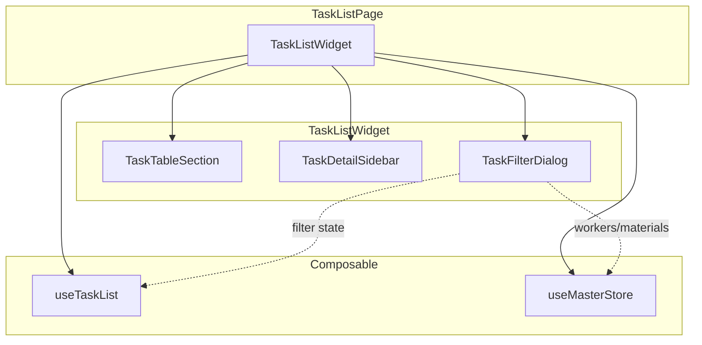
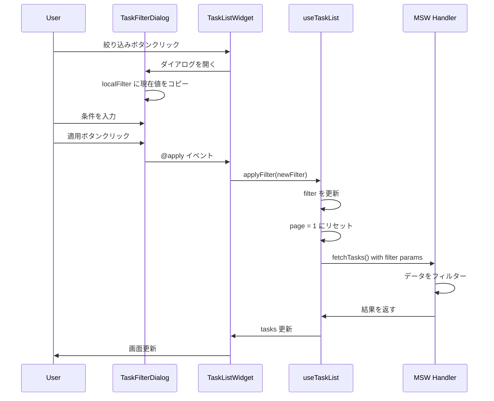

# Phase 4: 絞り込み機能 - 実装解説

このドキュメントでは、Phase 4 で実装した「絞り込み機能」について詳しく解説します。

---

## 1. Phase 4 の概要

### 実装した機能

| 機能 | 説明 |
|------|------|
| TaskFilterDialog | 絞り込み条件を入力するダイアログ |
| フィルター状態管理 | useTaskList に絞り込み状態を追加 |
| MSW フィルター対応 | handler でクエリパラメータを処理 |

### 実装したファイル

```
sample/
├── src/features/tasks/
│   ├── components/
│   │   └── TaskFilterDialog.vue    # 新規作成
│   │   └── TaskListWidget.vue      # 更新
│   └── model/
│       └── useTaskList.ts          # 更新
│
└── fe-libs/mocks/handlers/
    └── tasks.handlers.ts           # 更新
```

---

## 2. コンポーネント構成



---

## 3. TaskFilterDialog の実装

### 3.1 コンポーネント設計

```vue
<!-- TaskFilterDialog.vue -->
<script setup lang="ts">
interface Props {
  /** ダイアログ表示状態 */
  modelValue: boolean
  /** 作業者マスタ */
  workers: Worker[]
  /** 材料マスタ */
  materials: Material[]
  /** 現在のフィルター値 */
  currentFilter: FilterValues
}

interface FilterValues {
  workDateFrom: string
  workDateTo: string
  workerIds: string[]
  materialIds: string[]
}

const emit = defineEmits<{
  'update:modelValue': [value: boolean]
  'apply': [filter: FilterValues]
  'clear': []
}>()
</script>
```

### 3.2 ローカル状態パターン

ダイアログ内では「確定前のローカル状態」を持ちます：

```typescript
// 作業中のフィルター値（確定前）
const localFilter = ref<FilterValues>({
  workDateFrom: '',
  workDateTo: '',
  workerIds: [],
  materialIds: [],
})

// ダイアログが開いたときに現在のフィルター値を反映
watch(isOpen, (open) => {
  if (open) {
    localFilter.value = { ...props.currentFilter }
  }
})
```

**なぜローカル状態を持つのか？**

1. **キャンセル対応** - ユーザーがキャンセルしたときに元に戻せる
2. **即時反映の防止** - 入力中に親の状態が変わらない
3. **確定時のみ反映** - 「適用」ボタンで初めて親に通知

### 3.3 v-model による開閉制御

```typescript
const isOpen = computed({
  get: () => props.modelValue,
  set: (value) => emit('update:modelValue', value),
})
```

これにより、親コンポーネントから `v-model` で開閉を制御できます：

```vue
<TaskFilterDialog
  v-model="isFilterDialogOpen"
  ...
/>
```

---

## 4. useTaskList へのフィルター追加

### 4.1 フィルター型定義

```typescript
/**
 * フィルター条件
 */
export interface TaskFilter {
  workDateFrom: string
  workDateTo: string
  workerIds: string[]
  materialIds: string[]
}

/**
 * 初期フィルター値
 */
export const initialFilter: TaskFilter = {
  workDateFrom: '',
  workDateTo: '',
  workerIds: [],
  materialIds: [],
}
```

### 4.2 State / Computed / Actions

```typescript
export function useTaskList() {
  // ===================================
  // State
  // ===================================
  
  // フィルター
  const filter = ref<TaskFilter>({ ...initialFilter })

  // ===================================
  // Computed
  // ===================================
  
  /**
   * フィルターが適用されているか
   */
  const hasFilter = computed(() => {
    return (
      filter.value.workDateFrom !== '' ||
      filter.value.workDateTo !== '' ||
      filter.value.workerIds.length > 0 ||
      filter.value.materialIds.length > 0
    )
  })

  /**
   * 適用中のフィルター件数
   */
  const filterCount = computed(() => {
    let count = 0
    if (filter.value.workDateFrom || filter.value.workDateTo) count++
    if (filter.value.workerIds.length > 0) count++
    if (filter.value.materialIds.length > 0) count++
    return count
  })

  // ===================================
  // Actions
  // ===================================
  
  /**
   * フィルターを適用
   */
  function applyFilter(newFilter: TaskFilter) {
    filter.value = { ...newFilter }
    page.value = 1  // ページをリセット
    selectedTaskId.value = null
    fetchTasks()
  }

  /**
   * フィルターをクリア
   */
  function clearFilter() {
    filter.value = { ...initialFilter }
    page.value = 1
    selectedTaskId.value = null
    fetchTasks()
  }
}
```

### 4.3 API リクエストへの反映

```typescript
async function fetchTasks() {
  const params = new URLSearchParams({
    page: String(page.value),
    limit: String(limit.value),
    sortBy: sortBy.value,
    sortOrder: sortOrder.value,
  })

  // フィルター条件を追加
  if (filter.value.workDateFrom) {
    params.set('workDateFrom', filter.value.workDateFrom)
  }
  if (filter.value.workDateTo) {
    params.set('workDateTo', filter.value.workDateTo)
  }
  if (filter.value.workerIds.length > 0) {
    params.set('workerIds', filter.value.workerIds.join(','))
  }
  if (filter.value.materialIds.length > 0) {
    params.set('materialIds', filter.value.materialIds.join(','))
  }

  const response = await fetch(`/api/tasks?${params}`)
  // ...
}
```

---

## 5. MSW Handler のフィルター対応

### 5.1 クエリパラメータの解析

```typescript
export const getTasksHandler = http.get('/api/tasks', async ({ request }) => {
  const url = new URL(request.url)
  
  // フィルター条件
  const workDateFrom = url.searchParams.get('workDateFrom')
  const workDateTo = url.searchParams.get('workDateTo')
  const workerIdsParam = url.searchParams.get('workerIds')
  const materialIdsParam = url.searchParams.get('materialIds')

  const workerIds = workerIdsParam ? workerIdsParam.split(',') : []
  const materialIds = materialIdsParam ? materialIdsParam.split(',') : []
  
  // ...
})
```

### 5.2 フィルター処理

```typescript
// フィルター処理
let filteredData = [...tasksData]

// 作業日範囲フィルター
if (workDateFrom) {
  filteredData = filteredData.filter(t => t.workDate >= workDateFrom)
}
if (workDateTo) {
  filteredData = filteredData.filter(t => t.workDate <= workDateTo)
}

// 作業者フィルター（指定された作業者のいずれかが含まれているタスク）
if (workerIds.length > 0) {
  filteredData = filteredData.filter(t =>
    t.workers.some(w => workerIds.includes(w.id))
  )
}

// 材料フィルター（指定された材料のいずれかが含まれているタスク）
if (materialIds.length > 0) {
  filteredData = filteredData.filter(t =>
    t.materials.some(m => materialIds.includes(m.id))
  )
}
```

### 5.3 フィルター後のソートとページネーション

```typescript
// ソート処理（フィルター後のデータに対して）
const sortedData = filteredData.sort((a, b) => {
  // ...
})

// ページネーション（フィルター後の総数で計算）
const total = sortedData.length  // ← フィルター後の件数
const totalPages = Math.ceil(total / limit)
```

---

## 6. TaskListWidget の統合

### 6.1 マスタデータの取得

```typescript
import { useMasterStore } from '@/features/master/model/useMasterStore'

const { workers, materials } = useMasterStore()
```

フィルターダイアログに作業者・材料の選択肢を渡すため、マスタストアを利用します。

### 6.2 フィルター表示

```vue
<!-- 絞り込みボタン -->
<v-btn
  variant="outlined"
  :color="hasFilter ? 'primary' : undefined"
  prepend-icon="mdi-filter-variant"
  @click="handleOpenFilter"
>
  絞り込み
  <v-badge
    v-if="filterCount > 0"
    :content="filterCount"
    color="primary"
    inline
  />
</v-btn>

<!-- フィルター適用中チップ -->
<v-chip
  v-if="hasFilter"
  color="primary"
  variant="tonal"
  closable
  @click:close="handleClearFilter"
>
  <v-icon start>mdi-filter</v-icon>
  絞り込み条件をクリア
</v-chip>
```

---

## 7. 設計ポイントまとめ

### 7.1 フィルター条件の設計

| 条件 | 型 | フィルター方式 |
|------|-----|---------------|
| 作業日範囲 | string（日付） | 範囲フィルター（From/To） |
| 作業者 | string[] | OR 条件（いずれかに含まれる） |
| 材料 | string[] | OR 条件（いずれかに含まれる） |

### 7.2 状態管理の流れ



### 7.3 ページネーションとの関係

フィルター適用時は**必ず1ページ目に戻す**：

```typescript
function applyFilter(newFilter: TaskFilter) {
  filter.value = { ...newFilter }
  page.value = 1  // ← 重要！
  fetchTasks()
}
```

理由：
- フィルター後のデータ件数が変わる
- 現在のページが存在しない可能性がある
- ユーザー体験として最初から見直すのが自然

---

## 8. 完成したディレクトリ構成

```
sample/src/features/tasks/
├── components/
│   ├── index.ts
│   ├── TaskTableSection.vue     # Phase 2
│   ├── TaskDetailSidebar.vue    # Phase 2
│   ├── TaskListWidget.vue       # Phase 2 → Phase 4 で更新
│   ├── TaskFilterDialog.vue     # Phase 4 で追加
│   ├── TaskFormSection.vue      # Phase 3
│   └── TaskFormWidget.vue       # Phase 3
├── model/
│   ├── index.ts
│   ├── useTaskList.ts           # Phase 2 → Phase 4 で更新
│   └── useTaskForm.ts           # Phase 3
└── types/
    └── index.ts
```

---

## 9. 次のステップ

Phase 5 では以下を実装予定：

1. **AppToast** - 成功・エラー通知
2. **ローディング表示** - 処理中のフィードバック
3. **エラーハンドリング改善** - より詳細なエラー表示

