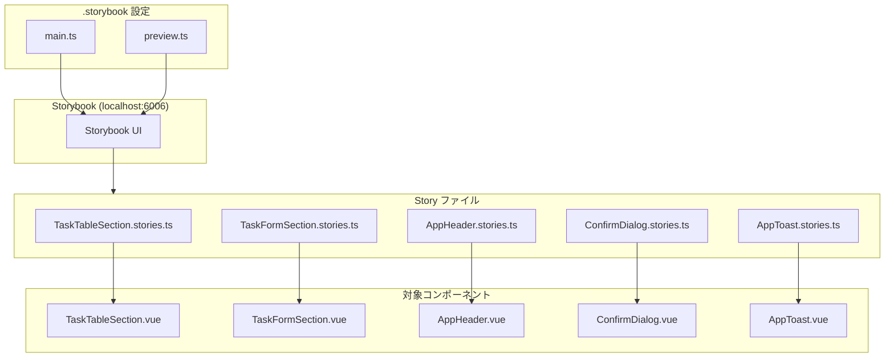

# Phase 5: Storybook 導入 実装解説

## 📌 このフェーズで実装した内容

- **Storybook 8.x のセットアップ**（Vue3 + Vite + Vuetify 対応）
- **sections コンポーネントの Story ファイル**
- **shared/ui コンポーネントの Story ファイル**
- **Vuetify 統合設定**（decorators による v-app ラップ）

---

## 🏗️ 作成ファイル一覧

```
sample/
├── .storybook/
│   ├── main.ts                  # Storybook 設定
│   └── preview.ts               # Vuetify 統合 + decorators
│
├── src/sections/tasks/
│   ├── TaskTableSection/
│   │   └── TaskTableSection.stories.ts    # 新規作成
│   └── TaskFormSection/
│       └── TaskFormSection.stories.ts     # 新規作成
│
└── src/shared/ui/
    ├── AppHeader/
    │   └── AppHeader.stories.ts           # 新規作成
    ├── ConfirmDialog/
    │   └── ConfirmDialog.stories.ts       # 新規作成
    └── AppToast/
        └── AppToast.stories.ts            # 新規作成
```

---

## 📐 アーキテクチャ図



### Storybook 対象レイヤー

```
┌─────────────────────────────────────────────────────┐
│ pages/         - ルーティング依存        ❌ 対象外  │
├─────────────────────────────────────────────────────┤
│ widgets/       - API・状態管理依存       ❌ 対象外  │
├─────────────────────────────────────────────────────┤
│ sections/      - Props で完結           ✅ 対象    │
├─────────────────────────────────────────────────────┤
│ shared/ui/     - 汎用 UI 部品           ✅ 対象    │
└─────────────────────────────────────────────────────┘
```

---

## 🔧 設定ファイル解説

### 1. .storybook/main.ts

Storybook のメイン設定ファイルです。

```typescript
import type { StorybookConfig } from "@storybook/vue3-vite";

const config: StorybookConfig = {
  // Story ファイルの検索パターン
  stories: [
    "../src/**/*.mdx",
    "../src/**/*.stories.@(js|jsx|mjs|ts|tsx)"
  ],
  
  // アドオン（Controls, Actions, Docs など基本機能）
  addons: ["@storybook/addon-essentials"],
  
  // Vue 3 + Vite フレームワーク
  framework: {
    name: "@storybook/vue3-vite",
    options: {},
  },
  
  docs: {},
  
  // Vite 設定を継承（パスエイリアスなど）
  viteFinal: async (config) => {
    return config;
  },
};

export default config;
```

**ポイント:**

| 設定 | 説明 |
|------|------|
| `stories` | `src/**/*.stories.ts` パターンで全 Story を検出 |
| `@storybook/addon-essentials` | Controls/Actions/Docs を一括追加 |
| `viteFinal` | vite.config.ts の設定（@/ エイリアス等）を継承 |

### 2. .storybook/preview.ts

Vuetify を Storybook で使うための重要な設定です。

```typescript
import type { Preview } from "@storybook/vue3";
import { setup } from "@storybook/vue3";

// ===== Vuetify セットアップ =====
import "vuetify/styles";
import "@mdi/font/css/materialdesignicons.css";
import { createVuetify } from "vuetify";
import * as components from "vuetify/components";
import * as directives from "vuetify/directives";

const vuetify = createVuetify({
  components,
  directives,
  theme: {
    defaultTheme: "light",
  },
});

// Vue アプリに Vuetify を登録
setup((app) => {
  app.use(vuetify);
});

// ===== プレビュー設定 =====
const preview: Preview = {
  parameters: {
    controls: {
      matchers: {
        color: /(background|color)$/i,
        date: /Date$/i,
      },
    },
    backgrounds: {
      default: "light",
      values: [
        { name: "light", value: "#FFFFFF" },
        { name: "dark", value: "#121212" },
        { name: "grey", value: "#F5F5F5" },
      ],
    },
  },
  
  // 全 Story を v-app でラップ（Vuetify 必須）
  decorators: [
    (story) => ({
      components: { story },
      template: `
        <v-app>
          <v-main>
            <v-container>
              <story />
            </v-container>
          </v-main>
        </v-app>
      `,
    }),
  ],
};

export default preview;
```

**重要:** Vuetify コンポーネントは `<v-app>` 内でないと正しく動作しないため、decorators で自動ラップしています。

---

## 🔍 各 Story ファイル解説

### 1. TaskTableSection.stories.ts

タスク一覧テーブルの Story。様々なデータ状態を確認できます。

```typescript
import type { Meta, StoryObj } from "@storybook/vue3";
import TaskTableSection from "./TaskTableSection.vue";
import type { Task } from "@/features/tasks/types";

/**
 * TaskTableSection - タスク一覧テーブル
 *
 * タスクデータをテーブル形式で表示するコンポーネント。
 * ソート機能と行選択機能を提供する。
 */
const meta: Meta<typeof TaskTableSection> = {
  title: "sections/tasks/TaskTableSection",  // サイドバーでの階層
  component: TaskTableSection,
  tags: ["autodocs"],  // Docs タブを自動生成
  argTypes: {
    tasks: { description: "タスク配列" },
    isLoading: { description: "ローディング状態", control: "boolean" },
    selectedTaskId: { description: "選択中のタスクID", control: "text" },
  },
};

export default meta;
type Story = StoryObj<typeof TaskTableSection>;

// モックデータ（Storybook 専用）
const mockTasks: Task[] = [
  {
    id: "task-1",
    workDate: "2024-01-15",
    workers: [
      { id: "w1", name: "山田太郎" },
      { id: "w2", name: "鈴木花子" },
    ],
    machine: { id: "m1", name: "掘削機A" },
    materials: [
      { id: "mat1", name: "セメント", amount: 100, unitId: "u1", unitName: "kg" },
    ],
    createdAt: "2024-01-15T09:00:00Z",
    updatedAt: "2024-01-15T10:30:00Z",
  },
  // ... 他のモックデータ
];
```

**作成した Story バリエーション:**

| Story 名 | 説明 | 確認ポイント |
|----------|------|-------------|
| `Default` | 通常表示（3件） | 基本的なテーブル表示 |
| `WithSelection` | 行選択状態 | 選択行のハイライト |
| `Loading` | ローディング中 | スケルトン表示 |
| `Empty` | データなし | 空状態メッセージ |
| `ManyItems` | 大量データ（10件） | スクロール動作 |
| `ManyMaterials` | 材料が多いケース | 材料列の省略表示 |

```typescript
/**
 * 通常表示
 */
export const Default: Story = {
  args: {
    tasks: mockTasks,
    isLoading: false,
    selectedTaskId: null,
  },
};

/**
 * ローディング中
 */
export const Loading: Story = {
  args: {
    tasks: [],
    isLoading: true,
    selectedTaskId: null,
  },
};

/**
 * データなし
 */
export const Empty: Story = {
  args: {
    tasks: [],
    isLoading: false,
    selectedTaskId: null,
  },
};
```

### 2. TaskFormSection.stories.ts

タスク登録・編集フォームの Story。複雑なフォームでは `render` 関数を使用します。

```typescript
import type { Meta, StoryObj } from "@storybook/vue3";
import { ref } from "vue";
import TaskFormSection from "./TaskFormSection.vue";
import type {
  TaskFormValues,
  TaskFormErrors,
} from "@/features/tasks/model/useTaskForm";

const meta: Meta<typeof TaskFormSection> = {
  title: "sections/tasks/TaskFormSection",
  component: TaskFormSection,
  tags: ["autodocs"],
};

export default meta;
type Story = StoryObj<typeof TaskFormSection>;

// マスタデータのモック
const mockWorkers = [
  { id: "w1", name: "山田太郎", department: "工事部" },
  { id: "w2", name: "鈴木花子", department: "工事部" },
];
const mockMachines = [
  { id: "m1", name: "掘削機A", category: "掘削" },
];
const mockMaterials = [
  { id: "mat1", name: "セメント", category: "建材", defaultUnitId: "u1" },
];
const mockUnits = [
  { id: "u1", name: "キログラム", symbol: "kg" },
];
```

**render 関数パターン（v-model 対応）:**

```typescript
/**
 * 空のフォーム（初期状態）
 */
export const Empty: Story = {
  render: () => ({
    components: { TaskFormSection },
    setup() {
      // リアクティブな状態を作成
      const form = ref<TaskFormValues>({
        workDate: "",
        workerIds: [],
        machineId: "",
        materials: [],
      });
      const errors = ref<TaskFormErrors>({
        workDate: "",
        workerIds: "",
        machineId: "",
        materials: "",
        general: "",
      });

      // イベントハンドラ
      const handleUpdate = (newForm: TaskFormValues) => {
        form.value = newForm;
      };
      const handleAddMaterial = () => {
        form.value.materials.push({ id: "", amount: null, unitId: "" });
      };
      const handleRemoveMaterial = (index: number) => {
        form.value.materials.splice(index, 1);
      };

      return {
        form, errors,
        workers: mockWorkers,
        machines: mockMachines,
        materials: mockMaterials,
        units: mockUnits,
        handleUpdate, handleAddMaterial, handleRemoveMaterial,
      };
    },
    template: `
      <TaskFormSection
        :form="form"
        :errors="errors"
        :workers="workers"
        :machines="machines"
        :materials="materials"
        :units="units"
        @update:form="handleUpdate"
        @add:material="handleAddMaterial"
        @remove:material="handleRemoveMaterial"
      />
    `,
  }),
};
```

**作成した Story バリエーション:**

| Story 名 | 説明 | 確認ポイント |
|----------|------|-------------|
| `Empty` | 空のフォーム | 初期表示 |
| `Filled` | 入力済みフォーム | データ表示 |
| `WithErrors` | バリデーションエラー | エラーメッセージ表示 |
| `ManyMaterials` | 材料が多い | リスト表示・スクロール |

### 3. AppHeader.stories.ts

共通ヘッダーの Story。スロットを使うパターンを含みます。

```typescript
import type { Meta, StoryObj } from "@storybook/vue3";
import AppHeader from "./AppHeader.vue";

const meta: Meta<typeof AppHeader> = {
  title: "shared/ui/AppHeader",
  component: AppHeader,
  tags: ["autodocs"],
  argTypes: {
    title: { description: "ページタイトル", control: "text" },
    showBack: { description: "戻るボタンを表示するか", control: "boolean" },
  },
};

export default meta;
type Story = StoryObj<typeof AppHeader>;

/**
 * 基本的な使用例
 */
export const Default: Story = {
  args: {
    title: "タスク一覧",
    showBack: false,
  },
};

/**
 * 戻るボタン付き
 */
export const WithBackButton: Story = {
  args: {
    title: "タスク編集",
    showBack: true,
  },
};
```

**スロットを使う Story:**

```typescript
/**
 * アクションボタン付き（#actions スロット）
 */
export const WithActions: Story = {
  args: {
    title: "タスク一覧",
    showBack: false,
  },
  render: (args) => ({
    components: { AppHeader },
    setup() {
      return { args };
    },
    template: `
      <AppHeader v-bind="args">
        <template #actions>
          <v-btn color="primary" prepend-icon="mdi-plus">新規作成</v-btn>
        </template>
      </AppHeader>
    `,
  }),
};
```

### 4. ConfirmDialog.stories.ts

確認ダイアログの Story。v-model とボタンクリックイベントを確認できます。

```typescript
const meta: Meta<typeof ConfirmDialog> = {
  title: "shared/ui/ConfirmDialog",
  component: ConfirmDialog,
  tags: ["autodocs"],
  argTypes: {
    title: { description: "ダイアログタイトル", control: "text" },
    message: { description: "確認メッセージ", control: "text" },
    confirmText: { description: "確認ボタンテキスト", control: "text" },
    cancelText: { description: "キャンセルボタンテキスト", control: "text" },
    confirmColor: {
      description: "確認ボタンの色",
      control: "select",
      options: ["primary", "error", "warning", "success"],
    },
    loading: { description: "処理中フラグ", control: "boolean" },
  },
};
```

**作成した Story バリエーション:**

| Story 名 | 説明 | 確認ポイント |
|----------|------|-------------|
| `Default` | 基本的な確認 | ダイアログ表示 |
| `DeleteConfirm` | 削除確認（赤ボタン） | 危険な操作の表現 |
| `CustomButtons` | カスタムテキスト | ボタン文言変更 |
| `Loading` | 処理中 | ローディング表示 |
| `Interactive` | 開閉デモ | ボタンでダイアログ表示 |

### 5. AppToast.stories.ts

トースト通知の Story。4種類のタイプを確認できます。

```typescript
/**
 * 成功メッセージ
 */
export const Success: Story = {
  args: {
    modelValue: true,
    message: "タスクを登録しました",
    type: "success",
    timeout: 4000,
  },
};

/**
 * エラーメッセージ
 */
export const Error: Story = {
  args: {
    modelValue: true,
    message: "タスクの登録に失敗しました",
    type: "error",
    timeout: 4000,
  },
};

/**
 * 全タイプ一覧（インタラクティブ）
 */
export const AllTypes: Story = {
  render: () => ({
    components: { AppToast },
    setup() {
      const showSuccess = ref(false);
      const showError = ref(false);
      const showWarning = ref(false);
      const showInfo = ref(false);
      return { showSuccess, showError, showWarning, showInfo };
    },
    template: `
      <div class="d-flex flex-column ga-4">
        <v-btn color="success" @click="showSuccess = true">成功</v-btn>
        <v-btn color="error" @click="showError = true">エラー</v-btn>
        <v-btn color="warning" @click="showWarning = true">警告</v-btn>
        <v-btn color="info" @click="showInfo = true">情報</v-btn>

        <AppToast v-model="showSuccess" message="成功しました" type="success" />
        <AppToast v-model="showError" message="エラーが発生しました" type="error" />
        <AppToast v-model="showWarning" message="警告です" type="warning" />
        <AppToast v-model="showInfo" message="情報です" type="info" />
      </div>
    `,
  }),
};
```

---

## 🚀 起動方法と確認

### Storybook 起動

```bash
cd sample
pnpm storybook
```

ブラウザで http://localhost:6006 を開きます。

### サイドバー構成

```
sections
└── tasks
    ├── TaskTableSection
    │   ├── Default
    │   ├── WithSelection
    │   ├── Loading
    │   ├── Empty
    │   ├── ManyItems
    │   └── ManyMaterials
    └── TaskFormSection
        ├── Empty
        ├── Filled
        ├── WithErrors
        └── ManyMaterials

shared
└── ui
    ├── AppHeader
    │   ├── Default
    │   ├── WithBackButton
    │   ├── WithActions
    │   └── FullHeader
    ├── ConfirmDialog
    │   ├── Default
    │   ├── DeleteConfirm
    │   ├── CustomButtons
    │   ├── Loading
    │   └── Interactive
    └── AppToast
        ├── Success
        ├── Error
        ├── Warning
        ├── Info
        └── AllTypes
```

---

## 📝 Story ファイル作成のパターン集

### パターン 1: args のみ（シンプル）

Props だけで完結するコンポーネント向け。

```typescript
export const Default: Story = {
  args: {
    title: "タイトル",
    isActive: true,
  },
};
```

### パターン 2: render 関数（v-model 対応）

双方向バインディングやイベントハンドラが必要な場合。

```typescript
export const Interactive: Story = {
  render: () => ({
    components: { MyComponent },
    setup() {
      const value = ref("");
      return { value };
    },
    template: `<MyComponent v-model="value" />`,
  }),
};
```

### パターン 3: スロット

`<template #slot-name>` を使う場合。

```typescript
export const WithSlot: Story = {
  args: { title: "タイトル" },
  render: (args) => ({
    components: { MyComponent },
    setup() { return { args }; },
    template: `
      <MyComponent v-bind="args">
        <template #actions>
          <v-btn>アクション</v-btn>
        </template>
      </MyComponent>
    `,
  }),
};
```

---

## 🎯 このフェーズのまとめ

| 項目 | 内容 |
|------|------|
| **対象レイヤー** | sections と shared/ui のみ |
| **設定ファイル** | main.ts（検索パターン）+ preview.ts（Vuetify統合） |
| **decorators** | 全 Story を v-app でラップ（Vuetify 必須） |
| **Story パターン** | args / render / スロット の3パターン |
| **バリエーション** | 正常系・エッジケース（空・ローディング・エラー）を網羅 |

### 次のステップ

- 新しい section コンポーネントを作成したら Story も一緒に作成
- MSW との連携は今後の課題（Storybook + MSW アドオン）
