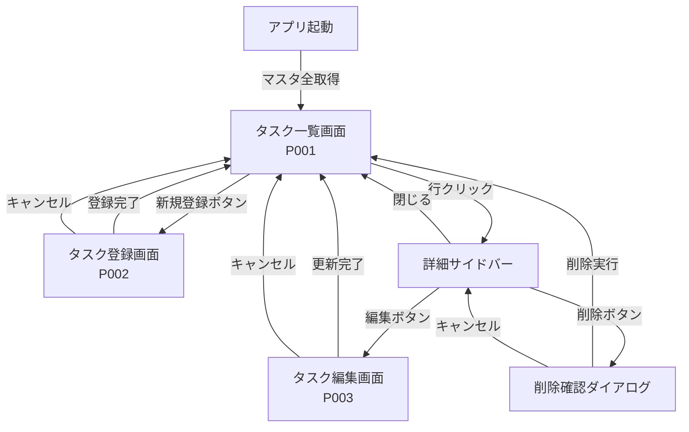

# サンプルアプリ要件定義書

このドキュメントは、Vue3 + CDD設計パターンを学ぶためのサンプルアプリケーション「タスク管理アプリ」の要件定義書です。

---

## 1. 概要

### 1.1 目的

本サンプルアプリは、以下を学習・実践するために作成します：

- Vue3 Composition API の実装パターン
- CDD（コンポーネント駆動開発）に基づく設計
- Pinia によるストア管理（マスタストア）
- MSW によるAPIモック
- Vuetify3 を使ったUI実装
- vue-router によるルーティング

### 1.2 技術スタック

| カテゴリ | 技術 |
|---------|------|
| フレームワーク | Vue 3 (Composition API) |
| UIライブラリ | Vuetify 3 |
| 状態管理 | Pinia |
| ルーティング | vue-router 4 |
| APIモック | MSW (Mock Service Worker) |
| ビルドツール | Vite |
| 言語 | TypeScript |

### 1.3 アプリケーション概要

作業タスクを管理するアプリケーションです。タスクには作業者・利用機械・利用材料などの情報が紐づき、マスタデータから選択して登録します。

---

## 2. 画面一覧

| 画面ID | 画面名 | パス | 説明 |
|--------|--------|------|------|
| P001 | タスク一覧画面 | `/tasks` | タスクの一覧表示・検索・詳細表示 |
| P002 | タスク登録画面 | `/tasks/new` | 新規タスクの登録 |
| P003 | タスク編集画面 | `/tasks/:id/edit` | 既存タスクの編集 |

---

## 3. 画面詳細

### 3.1 タスク一覧画面（P001）

#### 3.1.1 画面構成

```
+------------------------------------------------------------------+
|  [ヘッダー]                                                       |
|  タスク管理        [絞り込み]  [新規登録]                          |
+------------------------------------------------------------------+
|                                                                   |
|  [タスク一覧テーブル]                              [詳細サイドバー] |
|  +---------------------------------------------+  +-------------+ |
|  | 作業日    | 作業者   | 機械    | 材料   |   |  | タスク詳細  | |
|  |-----------|----------|---------|--------|   |  |             | |
|  | 2024/1/15 | 山田太郎 | 機械A   | 材料X  |   |  | 作業日:     | |
|  | 2024/1/16 | 鈴木花子 | 機械B   | 材料Y  |   |  | 2024/1/15   | |
|  | ...       | ...      | ...     | ...    |   |  |             | |
|  +---------------------------------------------+  | 作業者:     | |
|                                                   | 山田太郎    | |
|  [ページネーション]                                | 佐藤次郎    | |
|  < 1 2 3 4 5 ... 10 >                             |             | |
|                                                   | [編集][削除]| |
+------------------------------------------------------------------+
```

#### 3.1.2 機能詳細

##### ヘッダー部

| 要素 | 説明 |
|------|------|
| タイトル | 「タスク管理」を表示 |
| 絞り込みボタン | クリックで絞り込みダイアログを表示 |
| 新規登録ボタン | クリックでタスク登録画面（P002）へ遷移 |

**絞り込みボタンの表示状態：**

| 状態 | 表示 |
|------|------|
| 絞り込みなし | 白色背景、primaryカラーのボーダー（`variant="outlined"`） |
| 絞り込みあり | primaryカラー背景（`variant="flat" color="primary"`） |

##### タスク一覧テーブル

| カラム | 表示内容 | 備考 |
|--------|----------|------|
| 作業日 | `workDate` | YYYY/MM/DD形式 |
| 作業者 | `workers[0].name` | 複数選択時は代表1名のみ表示 |
| 利用機械 | `machine.name` | - |
| 利用材料 | `materials[0].name` | 複数選択時は代表1つのみ表示 |

**テーブル動作：**

- 1ページあたり10件表示
- 行クリックで詳細サイドバーを表示
- 選択中の行はハイライト表示

##### ページネーション

- 総ページ数を表示
- 前後ページへの移動ボタン
- ページ番号直接クリックで移動

##### 詳細サイドバー

一覧の行をクリックすると画面右側にスライドインで表示されます。

| 要素 | 説明 |
|------|------|
| タイトル | 「タスク詳細」 |
| 閉じるボタン | サイドバーを閉じる（×アイコン） |
| 詳細情報 | タスクの全項目を表示 |
| 編集ボタン | タスク編集画面（P003）へ遷移 |
| 削除ボタン | 削除確認ダイアログを表示 |

**詳細情報の表示項目：**

| 項目 | 表示形式 |
|------|----------|
| 作業日 | YYYY/MM/DD |
| 作業者 | 全員の名前をカンマ区切り or リスト表示 |
| 利用機械 | 機械名 |
| 利用材料 | 材料名と使用量・単位のリスト |

**削除確認ダイアログ：**

```
+----------------------------------+
|  タスクを削除しますか？            |
|                                   |
|  この操作は取り消せません。         |
|                                   |
|        [キャンセル]  [削除]        |
+----------------------------------+
```

- 削除ボタン押下でタスク削除APIを実行
- 成功時：サイドバーを閉じ、一覧を再取得
- 失敗時：エラーメッセージをトースト表示

---

### 3.2 タスク絞り込みダイアログ

#### 3.2.1 画面構成

```
+------------------------------------------+
|  タスク絞り込み                      [×]  |
+------------------------------------------+
|                                          |
|  作業日                                   |
|  [開始日         ] 〜 [終了日         ]   |
|                                          |
|  作業者                                   |
|  [▼ 選択してください                   ]  |
|                                          |
|  利用材料                                 |
|  [▼ 選択してください                   ]  |
|                                          |
+------------------------------------------+
|        [クリア]  [絞り込み]               |
+------------------------------------------+
```

#### 3.2.2 絞り込み項目

| 項目 | 入力形式 | 説明 |
|------|----------|------|
| 作業日（開始） | 日付ピッカー | 指定日以降のタスクを抽出 |
| 作業日（終了） | 日付ピッカー | 指定日以前のタスクを抽出 |
| 作業者 | 複数選択プルダウン | 作業者マスタから選択 |
| 利用材料 | 複数選択プルダウン | 材料マスタから選択 |

#### 3.2.3 ボタン動作

| ボタン | 動作 |
|--------|------|
| クリア | 全ての絞り込み条件をリセット |
| 絞り込み | 条件を適用してダイアログを閉じ、一覧を再取得 |
| ×（閉じる） | 条件を適用せずダイアログを閉じる |

---

### 3.3 タスク登録画面（P002）

#### 3.3.1 画面構成

```
+------------------------------------------------------------------+
|  [ヘッダー]                                                       |
|  ← タスク登録                                                     |
+------------------------------------------------------------------+
|                                                                   |
|  [登録フォーム]                                                    |
|                                                                   |
|  作業日 *                                                         |
|  [2024/01/15        ] (日付ピッカー)                              |
|                                                                   |
|  作業者 *                                                         |
|  [▼ 選択してください（複数選択可）                              ]  |
|                                                                   |
|  利用機械 *                                                       |
|  ○ 機械A  ○ 機械B  ○ 機械C  ○ 機械D                              |
|                                                                   |
|  利用材料                                                         |
|  [▼ 選択してください（複数選択可）                              ]  |
|  +-----------------------------------------------------------+   |
|  | 材料X                                      [使用量を入力] |   |
|  | 材料Y                                      [使用量を入力] |   |
|  +-----------------------------------------------------------+   |
|                                                                   |
|                                         [キャンセル]  [登録]      |
+------------------------------------------------------------------+
```

#### 3.3.2 入力項目

| 項目 | 入力形式 | 必須 | 説明 |
|------|----------|------|------|
| 作業日 | 日付ピッカー | ○ | Vuetify の v-date-input を使用 |
| 作業者 | 複数選択プルダウン | ○ | 作業者マスタから選択 |
| 利用機械 | ラジオボタン | ○ | 機械マスタから選択（単一選択） |
| 利用材料 | 複数選択プルダウン | - | 材料マスタから選択 |

**利用材料の追加入力：**

材料を選択すると、選択した材料ごとに以下の追加入力が必要になります。

| 項目 | 入力形式 | 説明 |
|------|----------|------|
| 使用量 | 数値入力 | 使用した量を入力 |
| 単位 | プルダウン | 単位マスタから選択 |

「使用量を入力」ボタンをクリックすると、材料使用量入力ダイアログが表示されます。

#### 3.3.3 材料使用量入力ダイアログ

```
+------------------------------------------+
|  材料X の使用量                      [×]  |
+------------------------------------------+
|                                          |
|  使用量 *                                 |
|  [          ] (数値入力)                  |
|                                          |
|  単位 *                                   |
|  [▼ kg                                ]  |
|                                          |
+------------------------------------------+
|                    [キャンセル]  [確定]   |
+------------------------------------------+
```

#### 3.3.4 ボタン動作

| ボタン | 動作 |
|--------|------|
| ← (戻る) | タスク一覧画面へ遷移（入力内容は破棄） |
| キャンセル | タスク一覧画面へ遷移（入力内容は破棄） |
| 登録 | タスク登録APIを実行 |

**登録成功時：**
- 成功メッセージをトースト表示
- タスク一覧画面へ遷移

**登録失敗時：**
- エラーメッセージをトースト表示
- 画面に留まる

---

### 3.4 タスク編集画面（P003）

#### 3.4.1 画面構成

タスク登録画面（P002）と同一レイアウト。

```
+------------------------------------------------------------------+
|  [ヘッダー]                                                       |
|  ← タスク編集                                                     |
+------------------------------------------------------------------+
|                                                                   |
|  [編集フォーム]                                                    |
|  （入力項目は登録画面と同一）                                       |
|  （既存データが初期値として設定される）                              |
|                                                                   |
|                                         [キャンセル]  [更新]      |
+------------------------------------------------------------------+
```

#### 3.4.2 初期表示

- 画面表示時にタスク詳細取得APIを実行
- 取得したデータをフォームの初期値として設定
- ローディング中はスケルトン表示

#### 3.4.3 ボタン動作

| ボタン | 動作 |
|--------|------|
| ← (戻る) | タスク一覧画面へ遷移（変更内容は破棄） |
| キャンセル | タスク一覧画面へ遷移（変更内容は破棄） |
| 更新 | タスク編集APIを実行 |

**更新成功時：**
- 成功メッセージをトースト表示
- タスク一覧画面へ遷移

---

## 4. データ定義

### 4.1 タスク（Task）

```typescript
interface Task {
  /** タスクID */
  id: string
  /** 作業日（ISO 8601形式） */
  workDate: string
  /** 作業者リスト */
  workers: TaskWorker[]
  /** 利用機械 */
  machine: TaskMachine
  /** 利用材料リスト */
  materials: TaskMaterial[]
  /** 作成日時 */
  createdAt: string
  /** 更新日時 */
  updatedAt: string
}

interface TaskWorker {
  /** 作業者ID（作業者マスタの参照） */
  id: string
  /** 作業者名 */
  name: string
}

interface TaskMachine {
  /** 機械ID（機械マスタの参照） */
  id: string
  /** 機械名 */
  name: string
}

interface TaskMaterial {
  /** 材料ID（材料マスタの参照） */
  id: string
  /** 材料名 */
  name: string
  /** 使用量 */
  amount: number
  /** 単位ID（単位マスタの参照） */
  unitId: string
  /** 単位名 */
  unitName: string
}
```

### 4.2 マスタデータ

#### 作業者マスタ（Worker）

```typescript
interface Worker {
  /** 作業者ID */
  id: string
  /** 作業者名 */
  name: string
  /** 部署 */
  department: string
}
```

#### 機械マスタ（Machine）

```typescript
interface Machine {
  /** 機械ID */
  id: string
  /** 機械名 */
  name: string
  /** 機械カテゴリ */
  category: string
}
```

#### 材料マスタ（Material）

```typescript
interface Material {
  /** 材料ID */
  id: string
  /** 材料名 */
  name: string
  /** 材料カテゴリ */
  category: string
}
```

#### 単位マスタ（Unit）

```typescript
interface Unit {
  /** 単位ID */
  id: string
  /** 単位名（表示用） */
  name: string
  /** 単位記号 */
  symbol: string
}
```

### 4.3 マスタ更新チェック

```typescript
interface MasterCheckResponse {
  /** 更新が必要なマスタ種別リスト */
  updatedMasters: MasterType[]
}

type MasterType = 'workers' | 'machines' | 'materials' | 'units'
```

---

## 5. API仕様

### 5.1 タスク関連API

#### GET /api/tasks - タスク一覧取得

**リクエストパラメータ（Query）：**

| パラメータ | 型 | 必須 | 説明 |
|-----------|-----|------|------|
| page | number | - | ページ番号（デフォルト: 1） |
| limit | number | - | 1ページあたりの件数（デフォルト: 10） |
| workDateFrom | string | - | 作業日（開始）YYYY-MM-DD |
| workDateTo | string | - | 作業日（終了）YYYY-MM-DD |
| workerIds | string | - | 作業者IDリスト（カンマ区切り） |
| materialIds | string | - | 材料IDリスト（カンマ区切り） |

**レスポンス（200 OK）：**

```typescript
interface TaskListResponse {
  /** タスクリスト */
  items: Task[]
  /** 総件数 */
  total: number
  /** 現在のページ */
  page: number
  /** 1ページあたりの件数 */
  limit: number
  /** 総ページ数 */
  totalPages: number
}
```

---

#### GET /api/tasks/:id - タスク詳細取得

**パスパラメータ：**

| パラメータ | 型 | 説明 |
|-----------|-----|------|
| id | string | タスクID |

**レスポンス（200 OK）：**

```typescript
interface TaskDetailResponse {
  task: Task
}
```

**エラーレスポンス（404 Not Found）：**

```typescript
interface ErrorResponse {
  message: string
}
```

---

#### POST /api/tasks - タスク登録

**リクエストボディ：**

```typescript
interface CreateTaskRequest {
  /** 作業日（YYYY-MM-DD） */
  workDate: string
  /** 作業者IDリスト */
  workerIds: string[]
  /** 機械ID */
  machineId: string
  /** 利用材料リスト */
  materials: CreateTaskMaterial[]
}

interface CreateTaskMaterial {
  /** 材料ID */
  id: string
  /** 使用量 */
  amount: number
  /** 単位ID */
  unitId: string
}
```

**レスポンス（201 Created）：**

```typescript
interface CreateTaskResponse {
  task: Task
}
```

**エラーレスポンス（400 Bad Request）：**

```typescript
interface ValidationErrorResponse {
  message: string
  errors: Record<string, string>
}
```

---

#### PUT /api/tasks/:id - タスク更新

**パスパラメータ：**

| パラメータ | 型 | 説明 |
|-----------|-----|------|
| id | string | タスクID |

**リクエストボディ：**

```typescript
interface UpdateTaskRequest {
  /** 作業日（YYYY-MM-DD） */
  workDate: string
  /** 作業者IDリスト */
  workerIds: string[]
  /** 機械ID */
  machineId: string
  /** 利用材料リスト */
  materials: CreateTaskMaterial[]
}
```

**レスポンス（200 OK）：**

```typescript
interface UpdateTaskResponse {
  task: Task
}
```

---

#### DELETE /api/tasks/:id - タスク削除

**パスパラメータ：**

| パラメータ | 型 | 説明 |
|-----------|-----|------|
| id | string | タスクID |

**レスポンス（204 No Content）：**

レスポンスボディなし

---

### 5.2 マスタ関連API

#### GET /api/masters - 全マスタ取得

初期表示時に全てのマスタデータを一括取得します。

**レスポンス（200 OK）：**

```typescript
interface MastersResponse {
  /** 作業者マスタ */
  workers: Worker[]
  /** 機械マスタ */
  machines: Machine[]
  /** 材料マスタ */
  materials: Material[]
  /** 単位マスタ */
  units: Unit[]
  /** マスタバージョン（更新チェック用） */
  versions: MasterVersions
}

interface MasterVersions {
  workers: string
  machines: string
  materials: string
  units: string
}
```

---

#### GET /api/masters/check - マスタ更新チェック

画面遷移時にマスタの更新有無を確認します。

**リクエストパラメータ（Query）：**

| パラメータ | 型 | 必須 | 説明 |
|-----------|-----|------|------|
| workersVersion | string | ○ | 現在の作業者マスタバージョン |
| machinesVersion | string | ○ | 現在の機械マスタバージョン |
| materialsVersion | string | ○ | 現在の材料マスタバージョン |
| unitsVersion | string | ○ | 現在の単位マスタバージョン |

**レスポンス（200 OK）：**

```typescript
interface MasterCheckResponse {
  /** 更新が必要なマスタ種別リスト */
  updatedMasters: MasterType[]
}

type MasterType = 'workers' | 'machines' | 'materials' | 'units'
```

---

#### GET /api/masters/:type - 個別マスタ取得

特定のマスタデータを取得します。

**パスパラメータ：**

| パラメータ | 型 | 説明 |
|-----------|-----|------|
| type | MasterType | マスタ種別 |

**レスポンス（200 OK）：**

```typescript
// type = 'workers' の場合
interface WorkersResponse {
  workers: Worker[]
  version: string
}

// type = 'machines' の場合
interface MachinesResponse {
  machines: Machine[]
  version: string
}

// type = 'materials' の場合
interface MaterialsResponse {
  materials: Material[]
  version: string
}

// type = 'units' の場合
interface UnitsResponse {
  units: Unit[]
  version: string
}
```

---

## 6. マスタストア設計

### 6.1 ストア構成

```typescript
// features/master/model/masterStore.ts
import { defineStore } from 'pinia'

interface MasterState {
  /** 作業者マスタ */
  workers: Worker[]
  /** 機械マスタ */
  machines: Machine[]
  /** 材料マスタ */
  materials: Material[]
  /** 単位マスタ */
  units: Unit[]
  /** マスタバージョン */
  versions: MasterVersions
  /** 初期化済みフラグ */
  initialized: boolean
  /** ローディング状態 */
  loading: boolean
}
```

### 6.2 マスタ取得フロー

#### 初期表示時

```
1. アプリ起動
2. masterStore.initialized をチェック
3. false の場合 → GET /api/masters で全マスタ取得
4. ストアに格納、initialized = true
```

#### 画面遷移時

```
1. 画面遷移検知（vue-router の beforeEach）
2. GET /api/masters/check でマスタ更新チェック
3. updatedMasters が空でない場合：
   - 各 type に対して GET /api/masters/:type を実行
   - ストアの該当マスタを更新
4. 画面遷移を続行
```

### 6.3 Composable

```typescript
// features/master/model/useMasterStore.ts

export function useMasterStore() {
  const store = useMasterStoreInternal()
  
  return {
    // State
    workers: computed(() => store.workers),
    machines: computed(() => store.machines),
    materials: computed(() => store.materials),
    units: computed(() => store.units),
    loading: computed(() => store.loading),
    
    // Actions
    initializeMasters: () => store.initialize(),
    checkAndUpdateMasters: () => store.checkAndUpdate(),
  }
}
```

---

## 7. MSWシナリオ定義

### 7.1 タスク一覧シナリオ

| シナリオ名 | 説明 | 用途 |
|-----------|------|------|
| `tasks-normal` | 通常データ（15件） | 通常開発 |
| `tasks-empty` | 0件 | 空表示確認 |
| `tasks-large` | 100件 | ページング確認 |
| `tasks-filtered` | フィルター結果（5件） | 絞り込み確認 |

### 7.2 タスク詳細シナリオ

| シナリオ名 | 説明 | 用途 |
|-----------|------|------|
| `task-detail-normal` | 正常データ | 通常開発 |
| `task-detail-not-found` | 404エラー | エラー表示確認 |

### 7.3 タスク登録シナリオ

| シナリオ名 | 説明 | 用途 |
|-----------|------|------|
| `task-create-success` | 登録成功 | 正常系確認 |
| `task-create-validation-error` | 400エラー | バリデーションエラー確認 |
| `task-create-server-error` | 500エラー | サーバーエラー確認 |

### 7.4 タスク更新シナリオ

| シナリオ名 | 説明 | 用途 |
|-----------|------|------|
| `task-update-success` | 更新成功 | 正常系確認 |
| `task-update-not-found` | 404エラー | 存在しないタスク |

### 7.5 タスク削除シナリオ

| シナリオ名 | 説明 | 用途 |
|-----------|------|------|
| `task-delete-success` | 削除成功 | 正常系確認 |
| `task-delete-server-error` | 500エラー | サーバーエラー確認 |

### 7.6 マスタシナリオ

| シナリオ名 | 説明 | 用途 |
|-----------|------|------|
| `masters-normal` | 通常マスタデータ | 通常開発 |
| `masters-updated` | マスタ更新あり | 差分更新確認 |
| `masters-slow` | 3秒遅延 | ローディング確認 |

---

## 8. ディレクトリ構成

```
sample/
├── src/
│   ├── app/
│   │   ├── App.vue
│   │   ├── main.ts
│   │   └── router/
│   │       └── index.ts
│   │
│   ├── pages/
│   │   └── tasks/
│   │       ├── TaskListPage.vue         # P001: 一覧画面
│   │       ├── TaskCreatePage.vue       # P002: 登録画面
│   │       └── TaskEditPage.vue         # P003: 編集画面
│   │
│   ├── widgets/
│   │   └── tasks/
│   │       ├── TaskListWidget/
│   │       │   ├── TaskListWidget.vue   # 一覧テーブル+サイドバー制御
│   │       │   └── index.ts
│   │       ├── TaskDetailSidebar/
│   │       │   ├── TaskDetailSidebar.vue
│   │       │   └── index.ts
│   │       ├── TaskFormWidget/
│   │       │   ├── TaskFormWidget.vue   # 登録/編集フォーム共通
│   │       │   └── index.ts
│   │       ├── TaskFilterDialog/
│   │       │   ├── TaskFilterDialog.vue # 絞り込みダイアログ
│   │       │   └── index.ts
│   │       └── MaterialAmountDialog/
│   │           ├── MaterialAmountDialog.vue # 材料使用量入力
│   │           └── index.ts
│   │
│   ├── sections/
│   │   └── tasks/
│   │       ├── TaskTableSection/
│   │       │   ├── TaskTableSection.vue
│   │       │   └── index.ts
│   │       ├── TaskDetailSection/
│   │       │   ├── TaskDetailSection.vue
│   │       │   └── index.ts
│   │       ├── TaskFormSection/
│   │       │   ├── TaskFormSection.vue
│   │       │   └── index.ts
│   │       └── MaterialListSection/
│   │           ├── MaterialListSection.vue
│   │           └── index.ts
│   │
│   ├── shared/
│   │   └── ui/
│   │       ├── AppHeader/
│   │       │   ├── AppHeader.vue
│   │       │   └── index.ts
│   │       ├── ConfirmDialog/
│   │       │   ├── ConfirmDialog.vue
│   │       │   └── index.ts
│   │       └── AppToast/
│   │           ├── AppToast.vue
│   │           └── index.ts
│   │
│   ├── features/
│   │   ├── tasks/
│   │   │   ├── model/
│   │   │   │   ├── useTaskList.ts
│   │   │   │   ├── useTaskDetail.ts
│   │   │   │   ├── useTaskForm.ts
│   │   │   │   └── useTaskFilter.ts
│   │   │   └── types/
│   │   │       └── index.ts
│   │   │
│   │   └── master/
│   │       ├── model/
│   │       │   ├── masterStore.ts
│   │       │   └── useMasterSync.ts
│   │       └── types/
│   │           └── index.ts
│   │
│   └── mocks/
│       └── browser.ts                    # MSW初期化
│
├── fe-libs/
│   ├── mocks/
│   │   ├── handlers/
│   │   │   ├── index.ts
│   │   │   ├── tasks.handlers.ts
│   │   │   └── masters.handlers.ts
│   │   ├── fixtures/
│   │   │   ├── tasks/
│   │   │   │   ├── tasks.normal.ts
│   │   │   │   ├── tasks.empty.ts
│   │   │   │   ├── tasks.large.ts
│   │   │   │   └── task.detail.ts
│   │   │   └── masters/
│   │   │       ├── workers.ts
│   │   │       ├── machines.ts
│   │   │       ├── materials.ts
│   │   │       └── units.ts
│   │   ├── scenarios/
│   │   │   ├── tasks.scenarios.ts
│   │   │   └── masters.scenarios.ts
│   │   └── index.ts
│   │
│   └── types/
│       ├── generated/
│       │   └── openapi.d.ts
│       └── index.ts
│
├── index.html
├── vite.config.ts
├── tsconfig.json
└── package.json
```

---

## 9. コンポーネント設計詳細

### 9.1 Pages（ページ）

#### TaskListPage.vue

| 責務 | 説明 |
|------|------|
| ルーティング受け | URL パラメータ（page, filter）を受け取る |
| レイアウト | ヘッダー + TaskListWidget の配置 |
| 初期化 | マスタ同期の起点 |

#### TaskCreatePage.vue

| 責務 | 説明 |
|------|------|
| ルーティング受け | - |
| レイアウト | ヘッダー + TaskFormWidget の配置 |
| 完了時遷移 | 登録成功後に一覧画面へ遷移 |

#### TaskEditPage.vue

| 責務 | 説明 |
|------|------|
| ルーティング受け | URL パラメータ（id）を受け取る |
| レイアウト | ヘッダー + TaskFormWidget の配置 |
| 初期データ取得 | タスク詳細APIを呼び出してフォームに設定 |

### 9.2 Widgets（ウィジェット）

#### TaskListWidget

- タスク一覧の取得・表示制御
- サイドバーの開閉制御
- ページネーション制御
- 絞り込みダイアログの開閉制御

#### TaskDetailSidebar

- タスク詳細の表示
- 編集・削除ボタンの配置
- 削除確認ダイアログの制御

#### TaskFormWidget

- 登録/編集フォームの制御
- 入力値の管理
- APIリクエストの実行
- 材料使用量ダイアログの制御

#### TaskFilterDialog

- 絞り込み条件の入力
- 条件のクリア・適用

#### MaterialAmountDialog

- 材料ごとの使用量・単位入力

### 9.3 Sections（セクション）

#### TaskTableSection

- v-data-table によるテーブル表示
- 行クリックイベントの発火
- ソート機能（必要に応じて）

#### TaskDetailSection

- タスク詳細情報のレイアウト
- 読み取り専用表示

#### TaskFormSection

- フォーム入力フィールドのレイアウト
- 各入力コンポーネントの配置

#### MaterialListSection

- 選択済み材料のリスト表示
- 使用量入力ボタンの表示

### 9.4 Shared/UI（共通UI）

#### AppHeader

- ページタイトル
- 戻るボタン（オプション）
- アクションボタンスロット

#### ConfirmDialog

- 汎用確認ダイアログ
- タイトル・メッセージ・ボタンをpropsで受け取る

#### AppToast

- トースト通知表示
- Vuetify の v-snackbar をラップ

---

## 10. 画面遷移図



---

## 11. 実装優先順位

### Phase 1: 基盤構築

1. プロジェクト初期設定（Vite + Vue3 + Vuetify3 + TypeScript）
2. ルーター設定
3. 型定義（Types）
4. マスタストア実装（Pinia）
5. MSW セットアップ
6. マスタ fixture / handler 作成

### Phase 2: 一覧画面

1. TaskListPage 実装
2. TaskListWidget 実装（一覧テーブル + サイドバー制御）
3. TaskTableSection 実装（ソート・ページネーション対応）
4. TaskDetailSidebar 実装（詳細表示・削除機能）
5. useTaskList Composable 実装
6. タスク一覧 fixture / handler 作成（GET/POST/PUT/DELETE）
7. ConfirmDialog 実装（削除確認）

### Phase 3: フォーム画面（登録・編集）

1. TaskCreatePage / TaskEditPage 実装
2. TaskFormWidget 実装（登録・編集共通）
3. TaskFormSection 実装（フォームUI）
4. useTaskForm Composable 実装（バリデーション含む）
5. AppHeader 実装（戻るボタン・アクション）
6. AppToast 実装（成功・エラー通知）

### Phase 4: 絞り込み機能

1. TaskFilterDialog 実装
2. useTaskList に絞り込み状態追加
3. フィルター付き一覧取得 handler 作成
4. MSW シナリオ切り替え機能（MswScenarioSwitcher）

### Phase 5: Storybook 導入

1. Storybook セットアップ（Vue3 + Vite + Vuetify 統合）
2. sections コンポーネントの Story 作成
   - TaskTableSection.stories.ts
   - TaskFormSection.stories.ts
3. shared/ui コンポーネントの Story 作成
   - AppHeader.stories.ts
   - ConfirmDialog.stories.ts
   - AppToast.stories.ts

---

## 12. 補足

### 12.1 Storybook対応

**sections** と **shared/ui** のコンポーネントには Storybook の Story ファイルを作成します。
（widgets/pages はAPIやルーティングに依存するため、Storybookの対象外）

```
sample/
├── src/
│   ├── sections/
│   │   └── tasks/
│   │       ├── TaskTableSection/
│   │       │   ├── TaskTableSection.vue
│   │       │   ├── TaskTableSection.stories.ts  # ← Story
│   │       │   └── index.ts
│   │       └── TaskFormSection/
│   │           ├── TaskFormSection.vue
│   │           ├── TaskFormSection.stories.ts   # ← Story
│   │           └── index.ts
│   │
│   └── shared/
│       └── ui/
│           ├── AppHeader/
│           │   ├── AppHeader.vue
│           │   ├── AppHeader.stories.ts         # ← Story
│           │   └── index.ts
│           ├── ConfirmDialog/
│           │   ├── ConfirmDialog.vue
│           │   ├── ConfirmDialog.stories.ts     # ← Story
│           │   └── index.ts
│           └── AppToast/
│               ├── AppToast.vue
│               ├── AppToast.stories.ts          # ← Story
│               └── index.ts
```

**実装済み**: Storybookは `pnpm storybook` で起動可能（http://localhost:6006）

### 12.2 テスト方針

本サンプルでは自動テストは対象外としますが、Storybookでの視覚的確認とMSWシナリオの切り替えによる動作確認を行います。

### 12.3 スタイリング

- Vuetify3 のコンポーネントを最大限活用
- カスタムスタイルは Scoped CSS で記述
- 色はVuetifyのテーマカラー（primary, secondary など）を使用

---

## 更新履歴

| 日付 | 版 | 内容 |
|------|-----|------|
| 2026/01/12 | 1.0 | 初版作成 |
